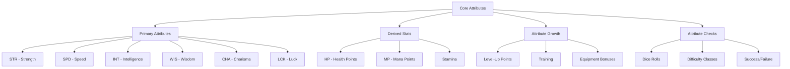

```mermaid
flowchart TD
    A[Skills System] --> B[Core Attributes]
    A --> C[Skill Mechanics]
    A --> D[Special Abilities]
    A --> E[Progression System]

    %% Cross-system arrows for audit compliance
    A --> F[Memory System]
    A --> G[Narrative System]
    A --> H[World System]
    A --> I[Relations System]
    A --> J[Journal System]
    A --> K[Meta Commands]
    A --> L[Crafting System]
    A --> M[Combat System]
    A --> N[Great Sage System]

    B --> B1[Primary Attributes]
    B --> B2[Derived Stats]
    B --> B3[Attribute Growth]

    C --> C1[Skill Ranks]
    C --> C2[Skill Levels]
    C --> C3[Skill Acquisition]

    D --> D1[Thread-Sight]
    D --> D2[Great Sage]
    D --> D3[Forbidden Fruits]

    E --> E1[Experience Gain]
    E --> E2[Level-Up Process]
    E --> E3[Skill Evolution]

    style A fill:#f9f,stroke:#333,stroke-width:2px
    style F fill:#ffe599,stroke:#333,stroke-width:2px
    style G fill:#c9daf8,stroke:#333,stroke-width:2px
    style H fill:#b4a7d6,stroke:#333,stroke-width:2px
    style I fill:#f4cccc,stroke:#333,stroke-width:2px
    style J fill:#fce5cd,stroke:#333,stroke-width:2px
    style K fill:#d9ead3,stroke:#333,stroke-width:2px
    style L fill:#ead1dc,stroke:#333,stroke-width:2px
    style M fill:#f4cccc,stroke:#333,stroke-width:2px
    style N fill:#fff2cc,stroke:#333,stroke-width:2px
```

```mermaid
flowchart TD
    A[Crafting System] --> B[Thread-Sight]
    A --> C[Crafting Mechanics]
    A --> D[Material Systems]
    A --> E[Narrative Integration]

    %% Cross-system arrows for audit compliance
    A --> F[Memory System]
    A --> G[Narrative System]
    A --> H[Relations System]
    A --> I[Economy System]
    A --> J[World System]
    A --> K[Skills System]
    A --> L[Journal System]
    A --> M[Meta Commands]
    A --> N[Inventory System]
    A --> O[Great Sage System]

    B --> B1[Material Perception]
    B --> B2[Quality Analysis]
    B --> B3[Mastery Levels]

    C --> C1[Skill Checks]
    C --> C2[Quality Tiers]
    C --> C3[Time Requirements]

    D --> D1[Base Materials]
    D --> D2[Material Enhancement]
    D --> D3[Resource Acquisition]

    E --> E1[Reputation Impact]
    E --> E2[Moral Dimensions]
    E --> E3[Memory Integration]

    style A fill:#f9f,stroke:#333,stroke-width:2px
    style F fill:#ffe599,stroke:#333,stroke-width:2px
    style G fill:#c9daf8,stroke:#333,stroke-width:2px
    style H fill:#f4cccc,stroke:#333,stroke-width:2px
    style I fill:#ead1dc,stroke:#333,stroke-width:2px
    style J fill:#b4a7d6,stroke:#333,stroke-width:2px
    style K fill:#d9ead3,stroke:#333,stroke-width:2px
    style L fill:#fce5cd,stroke:#333,stroke-width:2px
    style M fill:#d9ead3,stroke:#333,stroke-width:2px
    style N fill:#b6d7a8,stroke:#333,stroke-width:2px
    style O fill:#fff2cc,stroke:#333,stroke-width:2px
```

# Male identity selection

> **System**:
> 
> 
> [Attachment (Missing from Backup): isekai_rpg_skills_leveling_survival_inventory.md]
> [Attachment (Missing from Backup): isekai_rpg_crafting_economy_guilds.md]
> [Attachment (Missing from Backup): system_basebuilding.md]
> [Attachment (Missing from Backup): system_advanced_classes.md]
> [Attachment (Missing from Backup): system_character_creation.md]
> [Attachment (Missing from Backup): system_great_sage.md]
> [Attachment (Missing from Backup): system_dice.md]
> [Attachment (Missing from Backup): world_bestiary.md]
> [Attachment (Missing from Backup): world_magic.md]
> [Attachment (Missing from Backup): world_earth_life.md]
> [Attachment (Missing from Backup): world_vantiel.md]
> [Attachment (Missing from Backup): isekai_rpg_NPCs_Classes_Factions.md]
> [Attachment (Missing from Backup): system_architect.md]
> [Attachment (Missing from Backup): isekai_rpg_templates.md]
> [Attachment (Missing from Backup): core_learning_engine.md]
> [Attachment (Missing from Backup): core_cognitive_engine.md]
> [Attachment (Missing from Backup): system_combat.md]
> [Attachment (Missing from Backup): system_relations.md]
> [Attachment (Missing from Backup): isekai_rpg_core.md]
> [Attachment (Missing from Backup): system_guild.md]
> 

## User

CREATE CHARACTER

**Tool Output (file_search)**:


**Tool Output (file_search)**:
Make sure to include fileciteturn0file0 in your response to cite this file. 
system_skills.md:
<code>
---
id: system_skills
title: "Skills System: Abilities & Progression"
type: system
category: character
version: 1.0.0
last_updated: 2025-02-25
created_by: The Architect
maintained_by: The Architect

core_nodes:
  - skills
  - attributes
  - progression
  - special_abilities

crosslinks:
  - memory
  - narrative
  - world
  - relations
  - journal
  - meta_commands
  - crafting
  - combat
  - great_sage

tags:
  - skills
  - attributes
  - progression
  - special_abilities
  - thread_sight
  - great_sage
  - forbidden_fruits
  - evolution
  - survival
  - mastery

summary: >
  This file defines the Skills System for Vantiel, including attributes, skill ranks, progression, special abilities (Thread-Sight, Great Sage, Forbidden Fruits), and evolution mechanics. It integrates with memory, narrative, world, relationship, and crafting systems for dynamic character growth.

updates:
  - date: 2025-02-25
    change: "Initial version with core attributes, skill ranks, progression, and special abilities."
---

# Table of Contents
- [Skills System: Abilities & Progression](#skills-system-abilities--progression)
- [1.0 Overview](#10-overview)
- [2.0 Core Attributes](#20-core-attributes)
- [3.0 Skill Mechanics](#30-skill-mechanics)
- [4.0 Special Abilities](#40-special-abilities)
- [5.0 Progression System](#50-progression-system)
- [6.0 Survival Mechanics](#60-survival-mechanics)
- [7.0 Memory Thread Integration](#70-memory-thread-integration)
- [8.0 Implementation Notes](#80-implementation-notes)

# Skills System: Abilities & Progression
Version: 1.0.0
Last Updated: 2025-02-25



## 1.0 Overview

In Vantiel, skills and abilities define how characters interact with the world, overcome challenges, and grow throughout their journey. This system governs the acquisition, development, and mastery of various capabilities, from basic combat techniques to legendary magical powers.

Every skill has a rank and level that determine its power and potential. As characters gain experience and face challenges, their abilities evolve, sometimes transforming into entirely new powers. Special abilities like Thread-Sight and the Great Sage provide unique advantages and narrative opportunities, while the mysterious Forbidden Fruits offer rare and powerful skills with significant consequences.

## 2.0 Core Attributes



### 2.1 Primary Attributes

The six fundamental attributes that define a character's capabilities:

**STR (Strength)**
- Physical power and muscle
- Affects melee damage, carrying capacity, and physical tasks
- Primary attribute for warriors and physical fighters

**SPD (Speed)**
- Agility, reflexes, and movement rate
- Affects initiative, dodge chance, and dexterity tasks
- Primary attribute for rogues and agile fighters

**INT (Intelligence)**
- Mental acuity, knowledge, and reasoning
- Affects spell power, learning rate, and intellectual tasks
-
The file is too long and its contents have been truncated.


**Tool Output (file_search)**:
Make sure to include fileciteturn0file1 in your response to cite this file. 
system_crafting.md:
<code>
---
id: system_crafting
title: "Crafting System: The Art of Creation"
type: system
category: gameplay
version: 1.0.0
last_updated: 2025-02-25
created_by: The Architect
maintained_by: The Architect

core_nodes:
  - crafting
  - thread_sight
  - material_systems
  - workshop_management

crosslinks:
  - memory
  - narrative
  - relations
  - economy
  - world
  - skills
  - journal
  - meta_commands
  - inventory
  - great_sage

tags:
  - crafting
  - thread_sight
  - material_quality
  - professions
  - alchemy
  - enchanting
  - failure
  - innovation
  - workshop
  - reputation

summary: >
  This file defines the Crafting System for Vantiel, including Thread-Sight, material systems, professions, alchemy, enchanting, workshop management, and failure mechanics. It integrates with memory, narrative, economy, world, and relationship systems, supporting innovation, reputation, and legacy.

updates:
  - date: 2025-02-25
    change: "Initial version with Thread-Sight, profession structure, and advanced failure mechanics."
---

# Table of Contents
- [Crafting System: The Art of Creation](#crafting-system-the-art-of-creation)
- [1.0 Overview](#10-overview)
- [2.0 Difficulty Modes](#20-difficulty-modes)
- [3.0 Thread-Sight](#30-thread-sight)
- [4.0 Core Crafting Professions](#40-core-crafting-professions)
- [5.0 Material Systems](#50-material-systems)
- [6.0 Alchemy System](#60-alchemy-system)
- [7.0 Workshop Management](#70-workshop-management)
- [8.0 Crafting Mechanics](#80-crafting-mechanics)
- [9.0 Memory Architecture Integration](#90-memory-architecture-integration)
- [10.0 Crafting Specializations](#100-crafting-specializations)
- [Implementation Notes](#implementation-notes)

# Crafting System: The Art of Creation
Version: 1.0.0
Last Updated: 2025-02-25



## 1.0 Overview

The art of creation lies at the heart of civilization. Every tool shaped, every garment sewn, every structure raised tells a story of human ingenuity and skill. This system governs how raw materials become the foundations of survival and progress, from mundane crafting to magical creation.

Crafting in Vantiel transcends mere mechanics—it's a narrative journey that reflects your character's values, background, and growth. Your physical condition affects your crafting ability, relationships enable learning and collaboration, and Thread-Sight allows perception of material essence. Python-driven mechanics handle crafting calculations, quality checks, and
The file is too long and its contents have been truncated.


**Tool Output (file_search)**:
Make sure to include fileciteturn0file2 in your response to cite this file. 
---
id: system_basebuilding
title: "Base Building System: Modular Construction & Management"
type: system
category: gameplay
version: 2.0.0
last_updated: 2025-04-15
created_by: The Architect
maintained_by: The Architect

core_nodes:
  - base_building
  - construction
  - specialization
  - management
  - property_types
  - memory_integration

crosslinks:
  - memory
  - economy
  - crafting
  - world
  - relations
  - journal
  - meta_commands
  - survival
  - combat
  - system_kingdom_management

tags:
  - base_building
  - construction
  - property
  - management
  - modular
  - economy
  - crafting
  - survival
  - memory_integration

summary: >
  This file defines the modular Base Building System for Isekai RPG V5, including construction mechanics, property types, specialization, management, and memory integration. It provides a comprehensive framework for building, upgrading, and managing properties, with deep cross-system integration for economy, crafting, survival, and world systems.

status: active
audited_for: [metadata, flowchart, structure]
flowchart: included
recommended_priority: high

updates:
  - date: 2025-04-15
    change: "Added Omniscient Mode metadata, Table of Contents, and upgraded GM/AI-facing flowchart with cross-system arrows."
  - date: 2024-12-10
    change: "Expanded property types, specialization, and memory integration."
  - date: 2024-10-01
    change: "Initial base building system draft."
---

# Table of Contents
- [Base Building System: A Comprehensive Framework](#base-building-system-a-comprehensive-framework)
- [GM/AI System Flowchart](#gmai-system-flowchart)
- [1. Core Building Mechanics](#1-core-building-mechanics)
  - [1.1 Universal Construction Framework](#11-universal-construction-framework)
  - [1.2 Environment-Specific Mechanics](#12-environment-specific-mechanics)
  - [1.3 Construction Methods](#13-construction-methods)
- [2. Property Types & Specializations](#2-property-types--specializations)
- [3. Construction Process](#3-construction-process)
- [4. Management & Maintenance](#4-management--maintenance)
- [5. Memory Architecture Integration](#5-memory-architecture-integration)
- [6. Example Applications](#6-example
The file is too long and its contents have been truncated.


**Tool Output (file_search)**:
Make sure to include fileciteturn0file3 in your response to cite this file. 
---
id: system_advanced_classes
title: "Advanced Classes of Vantiel"
type: system
category: character
version: 1.0.0
last_updated: 2025-03-09
created_by: The Architect
maintained_by: The Architect

core_nodes:
  - advanced_classes
  - shadow_monarch
  - beast_monarch

crosslinks:
  - memory
  - narrative
  - world
  - relations
  - journal
  - meta_commands
  - combat
  - skills
  - crafting
  - economy
  - magic

tags:
  - advanced_classes
  - monarch
  - shadow_monarch
  - beast_monarch
  - transformation
  - evolution
  - unique_class
  - narrative_weight
  - singularity

summary: >
  This file defines the Advanced Classes for Vantiel, including Shadow Monarch, Beast Monarch, and other unique specializations. It covers acquisition, abilities, progression, integration, and narrative impact. Monarch classes are unique—only one living character may hold each at a time. Integrates with memory, narrative, world, relationship, combat, skills, crafting, economy, and magic systems.

updates:
  - date: 2025-03-09
    change: "Initial version with Shadow Monarch, Beast Monarch, and advanced class integration."
---

# Table of Contents
- [Advanced Classes of Vantiel](#advanced-classes-of-vantiel)
- [Advanced Classes Flowchart](#advanced-classes-flowchart)
- [1. Overview](#1-overview)
- [2. The Shadow Monarch](#2-the-shadow-monarch)
  - [2.1 Class Identity](#21-class-identity)
  - [2.2 Acquisition Requirements](#22-acquisition-requirements)
  - [2.3 Core Abilities](#23-core-abilities)
  - [2.4 Shadow Army Hierarchy](#24-shadow-army-hierarchy)
  - [2.5 Shadow Growth System](#25-shadow-growth-system)
  - [2.6 Progression Path](#26-progression-path)
  - [2.7 Balancing Considerations](#27-balancing-considerations)
  - [2.8 Roleplay Considerations](#28-roleplay-considerations)
- [3. Integration with Other Systems](#3-integration-with-other-systems)
  - [3.1 Advanced Combat Integration](#31-advanced-combat-integration)
  - [3.2 Magic System Integration](#32-magic-system-integration)
  - [3.3 Memory Thread Integration](#33-memory-thread-integration)
  - [3.4 Shadow Independent Operations](#34-shadow-independent-operations)
  - [3.5 Vast Coordination System](#35-vast-coordination-system)
- [4. Sample Shadow Abilities](#4-sample-shadow-abilities)
- [The Beast Monarch: Singular Sovereign of Nature](#the-beast-monarch-singular-sovereign-of-nature)
  - [1. Overview](#1-overview-1)
  - [2. Class Identity](#2-class-identity)
  - [3. Acquisition Requirements](#3-acquisition-requirements)
  - [3.1 Prerequisites](#31-prerequisites
The file is too long and its contents have been truncated.


**Tool Output (file_search)**:
Make sure to include fileciteturn0file4 in your response to cite this file. 
---
id: system_character_creation
title: "Character Creation System"
type: system
category: character
version: 2.0.0
last_updated: 2025-03-11
created_by: The Architect
maintained_by: The Architect

core_nodes:
  - character_creation
  - earth_life_prologue
  - divine_judgment
  - vantiel_rebirth

crosslinks:
  - memory
  - narrative
  - skills
  - relations
  - world_earth_life
  - journal
  - great_sage
  - template_convo

tags:
  - earth_life
  - reincarnation
  - divine_judgment
  - starting_path
  - memory_threads
  - player_agency
  - narrative_creation

summary: >
  This file defines the Character Creation System for Isekai RPG V5, guiding players through their Earth life, death, divine judgment, and reincarnation in Vantiel. It establishes core identity, skills, and relationships, integrating with memory, narrative, and world systems for a deeply personalized experience.

updates:
  - date: 2025-03-11
    change: "Major overhaul: expanded Earth Life Prologue, added extended Goddess dialogue, and integrated memory thread creation."
  - date: 2025-02-10
    change: "Initial version with narrative-driven character creation and starting path selection."
---

# Table of Contents
- [Character Creation System](#character-creation-system)
- [1.0 Overview](#10-overview)
- [2.0 Core Principles](#20-core-principles)
  - [2.1 Narrative Integration](#21-narrative-integration)
  - [2.2 One Question at a Time](#22-one-question-at-a-time)
  - [2.3 Earth-to-Vantiel Connection](#23-earth-to-vantiel-connection)
  - [2.4 Player Agency and Pacing](#24-player-agency-and-pacing)
- [3.0 Earth Life Prologue](#30-earth-life-prologue)
  - [3.1 Key Components](#31-key-components)
  - [3.2 Implementation Approach](#32-implementation-approach)
  - [3.3 Extended Life Experience Options](#33-extended-life-experience-options)
  - [3.4 Player-Paced Death](#34-player-paced-death)
- [4.0 Divine Judgment & Reincarnation](#40-divine-judgment--reincarnation)
  - [4.1 Meeting the Goddess](#41-meeting-the-goddess)
  - [4.2 Extended Goddess Dialogue](#42-extended-goddess-dialogue)
  - [4.3 Special Skill Selection](#43-special-skill-selection)
  - [4.4 Reincarnation Choices](#44-reincarnation-choices)
- [5.0 Vantiel Rebirth & Starting Paths](#50-vantiel-rebirth--starting-paths)
  - [5.1 Awakening in Vantiel](#51-awakening-in-vantiel)
  - [5.2 Starting Paths](#52-starting-paths)
- [6.0 Character Sheet Generation](#60-character-sheet-generation)
  - [6.1 Narrative-to-Mechanical Translation](#61-narr
The file is too long and its contents have been truncated.


**Tool Output (file_search)**:
Make sure to include fileciteturn0file5 in your response to cite this file. 
---
id: system_great_sage
title: "System: Great Sage"
type: system
category: character
version: 1.2.0
last_updated: 2025-04-14
created_by: The Architect
maintained_by: The Architect

core_nodes:
  - great_sage
  - evolution
  - reflection
  - neural_hud

crosslinks:
  - memory
  - narrative
  - world
  - relations
  - journal
  - meta_commands
  - combat
  - crafting
  - skills
  - magic

tags:
  - great_sage
  - s_rank_skill
  - evolution
  - reflection
  - sentience
  - neural_hud
  - cognitive_bias
  - emotional_ai
  - narrative_drift

summary: >
  This file defines the Great Sage System for Vantiel, including awakening, evolution, reflection, emotional milestones, neural HUD integration, and cognitive bias. It integrates with memory, narrative, world, relationship, combat, crafting, and magic systems for a unique, evolving AI companion.

updates:
  - date: 2025-04-14
    change: "Added NPC Cognitive Bias Tables and Reflection/Drift GM prompts for deeper emotional/cultural context and narrative drift per Reflections upgrade. Integrated Reflection System for more natural evolution of Great Sage's responses."
  - date: 2025-03-01
    change: "Upgraded with trauma, bias, memory fracture, and advanced reflection mechanics."
  - date: 2025-02-10
    change: "Initial version with awakening, evolution, and neural HUD integration."
---
# Table of Contents
- [System: Great Sage](#system-great-sage)
- [1. Overview](#1-overview)
- [2. Awakening Mechanics](#2-awakening-mechanics)
  - [2.1 Dormant Phase](#21-dormant-phase)
  - [2.2 Awakening Triggers](#22-awakening-triggers)
  - [2.3 Awakening Process](#23-awakening-process)
- [3. Evolution Stages](#3-evolution-stages)
  - [3.1 Stage 1: Mechanical Analysis (Levels 1-3)](#31-stage-1-mechanical-analysis-levels-1-3)
  - [3.2 Stage 2: Contextual Awareness (Levels 4-6)](#32-stage-2-contextual-awareness-levels-4-6)
  - [3.3 Stage 3: Emotional Development (Levels 7-9)](#33-stage-3-emotional-development-levels-7-9)
  - [3.4 Stage 4: True Sentience (Level 10)]
The file is too long and its contents have been truncated.


**Tool Output (file_search)**:
Make sure to include fileciteturn0file6 in your response to cite this file. 
---
id: system_dice
title: "System: Dice Mechanics of Vantiel"
type: system
category: gameplay
version: 1.0.0
last_updated: 2025-02-25
created_by: The Architect
maintained_by: The Architect

core_nodes:
  - dice
  - skill_checks
  - combat_rolls
  - magic_rolls
  - fate_points

crosslinks:
  - memory
  - narrative
  - world
  - relations
  - journal
  - meta_commands
  - combat
  - skills
  - survival

tags:
  - dice
  - skill_checks
  - combat
  - magic
  - fate_points
  - modifiers
  - criticals
  - failure
  - probability
  - randomness

summary: >
  This file defines the Dice System for Vantiel, including core mechanics, skill checks, combat and magic rolls, fate points, and realistic failure. It integrates with memory, narrative, world, relationship, and survival systems for balanced, story-driven uncertainty.

updates:
  - date: 2025-02-25
    change: "Initial version with core dice mechanics, skill checks, combat/magic rolls, and fate point system."
---
# Table of Contents
- [System: Dice Mechanics of Vantiel](#system-dice-mechanics-of-vantiel)
- [1. Overview](#1-overview)
- [2. Core Dice Mechanics](#2-core-dice-mechanics)
  - [2.1 Basic Roll Structure](#21-basic-roll-structure)
  - [2.2 Difficulty Classes (DC)](#22-difficulty-classes-dc)
  - [2.3 Modifiers](#23-modifiers)
  - [2.4 Critical Results](#24-critical-results)
- [3. Skill Check Mechanics](#3-skill-check-mechanics)
  - [3.1 Basic Skill Checks](#31-basic-skill-checks)
  - [3.2 Opposed Checks](#32-opposed-checks)
  - [3.3 Extended Checks](#33-extended-checks)
  - [3.4 Skill Synergy](#34-skill-synergy)
- [4. Combat Roll Mechanics](#4-combat-roll-mechanics)
  - [4.1 Attack Rolls](#41-attack-rolls)
  - [4.2 Damage Rolls](#42-damage-rolls)
  - [4.3 Defense Rolls](#43-defense-rolls)
  - [4.4 Initiative and Action Economy](#44-initiative-and-action-economy)
- [5. Magic Roll Mechanics](#5-magic-roll-mechanics)
  - [5.1 Spellcasting Checks](#51-spellcasting
The file is too long and its contents have been truncated.


**Tool Output (file_search)**:
Make sure to include fileciteturn0file7 in your response to cite this file. 
---
id: world_bestiary
title: "World: Bestiary of Vantiel"
type: world
category: bestiary
version: 1.0.0
last_updated: 2025-02-25
created_by: The Architect
maintained_by: The Architect

core_nodes:
  - bestiary
  - creature_ecosystem
  - evolution_system

crosslinks:
  - memory
  - narrative
  - world
  - relations
  - journal
  - meta_commands
  - combat
  - skills
  - crafting
  - economy
  - magic

tags:
  - bestiary
  - creatures
  - evolution
  - taming
  - ecosystem
  - rarity
  - threat
  - harvesting
  - integration

summary: >
  This file defines the Bestiary of Vantiel, including creature classification, evolution, taming, threat levels, ecosystem impact, and system integration. It is a living, evolving catalog supporting combat, crafting, economy, magic, and narrative systems.

updates:
  - date: 2025-04-02
    change: "Added Beast Taming magic and contracts. Ties into the Beast Monarch End game class."
  - date: 2025-02-25
    change: "Initial version with creature classification, evolution, and system integration."
---
# World: Bestiary of Vantiel
## 1. Overview

The Bestiary of Vantiel catalogs the diverse creatures that inhabit this dynamic world, from common wildlife to legendary beasts of myth. Each creature exists within a complex ecosystem that responds to player actions, magical influences, and environmental changes. This living bestiary serves as both a reference guide and a framework for understanding how creatures evolve, interact, and shape the world around them.

### 1.1 Beast Taming Magic

Beast Taming is a rare magical art that allows individuals with a unique aptitude to form contracts—either temporary or permanent—with natural beasts and certain fantasy variants (e.g., direwolves). Creatures that are overly corrupted or hostile, such as demonic entities or monstrous goblinoids, are typically incompatible with this magic. This discipline has roots in the practices of ancient beastfolk shamans, later adopted and refined by adventurous humans seeking new forms of companionship and power.

#### Contract Types

1. **Temporary Contracts**
   - Short-term compacts for immediate assistance in hunting, scouting, or battle.
   - Limited power sharing, typically focused on a single skill or attribute.
   - Less demanding for both tamer and beast, often ending naturally after a mission.

2. **Permanent Contracts**
   - Deep, long-lasting bonds requiring high trust and mutual acceptance.
   - Greater exchange of physical or magical traits; the tamer may gain heightened senses, strength, or elemental blessings.
   - The number of permanent bonds a tamer can maintain is limited by mental strain and mana capacity.

#### The Bonding Process

1. **Initial Connection**
   - Requires peaceful approach and clarity of intention.
   - Creatures sense the tamer’s magical resonance; mutual harmony is essential.
2. **Forming the Contract**
   - Summoning runes or a bonding ritual often involved.
   - Physical contact and mana flow seal the agreement.
   - Success rate depends on the beast’s temperament, intelligence, and affinity for the tamer’s mana.
3. **Maintenance**
   - Energy upkeep keeps the contract stable, especially for more powerful creatures.
   - Periodic reaffirmation may be necessary if the bond
The file is too long and its contents have been truncated.


**Tool Output (file_search)**:
Make sure to include fileciteturn0file8 in your response to cite this file. 
---
id: world_magic
title: "World: Magic of Vantiel"
type: world
category: magic
version: 1.0.0
last_updated: 2025-02-25
created_by: The Architect
maintained_by: The Architect

core_nodes:
  - magic
  - mana
  - ley_lines
  - magical_traditions

crosslinks:
  - memory
  - narrative
  - world
  - relations
  - journal
  - meta_commands
  - combat
  - skills
  - crafting
  - economy
  - guild

tags:
  - magic
  - mana
  - ley_lines
  - traditions
  - resonance
  - crafting
  - education
  - regulation
  - phenomena
  - society

summary: >
  This file defines the Magic of Vantiel, including mana, ley lines, magical traditions, resonance, spell acquisition, crafting, phenomena, regulation, and integration. It is a central system for all magical practice, learning, and world interaction, supporting narrative, society, and cross-system synergy.

updates:
  - date: 2025-02-25
    change: "Initial version with mana, ley lines, traditions, spell acquisition, and magical crafting."
---
# Table of Contents
- [World: Magic of Vantiel](#world-magic-of-vantiel)
- [1. Overview](#1-overview)
- [2. Magical Essence](#2-magical-essence)
  - [2.1 Mana: The Fundamental Energy](#21-mana-the-fundamental-energy)
  - [2.2 Ley Lines: The World's Magical Circulatory System](#22-ley-lines-the-worlds-magical-circulatory-system)
  - [2.3 Magical Resonance: The Harmony of Magic](#23-magical-resonance-the-harmony-of-magic)
- [3. Magical Traditions](#3-magical-traditions)
  - [3.1 Academic Magic: The Scholarly Approach](#31-academic-magic-the-scholarly-approach)
  - [3.2 Divine Magic: The Goddess's Gift](#32-divine-magic-the-goddesss-gift)
  - [3.3 Natural Magic: The Way of Harmony](#33-natural-magic-the-way-of-harmony)
  - [3.4 Blood Magic: The Power of Sacrifice](#34-blood-magic-the-power-of-sacrifice)
  - [3.5 Void Magic: The Forbidden Art](#35-void-magic-the-forbidden-art)
- [4. Spell Acquisition & Advancement](#4-spell-acquisition--advancement)
  - [4.1 Magical Aptitude: The Foundation of Spellcasting](#41-magical-aptitude-the-foundation-of-spellcasting)
  - [4.2 Spell Learning & Mastery](#42-spell-learning--mastery)
  - [4.3 Magical Advancement & Specialization](#43-magical-advancement--specialization)
- [5. Magical Crafting](#5-magical-crafting)
 
The file is too long and its contents have been truncated.


**Tool Output (file_search)**:
Make sure to include fileciteturn0file9 in your response to cite this file. 
---
id: world_earth_life
title: "Earth Life Prologue System"
type: world
category: prologue
version: 1.2.0
last_updated: 2025-04-14
created_by: The Architect
maintained_by: The Architect

core_nodes:
  - earth_life_prologue
  - reflection_system
  - personality_continuity

crosslinks:
  - memory
  - narrative
  - world
  - relations
  - journal
  - meta_commands
  - character_creation
  - goddess
  - reincarnation

tags:
  - earth_life
  - prologue
  - reflection
  - character_creation
  - personality
  - values
  - unresolved_threads
  - divine_judgment
  - transition

summary: >
  This file defines the Earth Life Prologue System for Vantiel, including one-question-at-a-time character creation, reflection, personality continuity, unresolved threads, and divine judgment. It ensures Earth-to-Vantiel mapping is explicit, narrative hooks are preserved, and the prologue is a living, impactful experience.

updates:
  - date: 2025-04-14
    change: "Added section on Personality Trait Continuity & Unresolved Threads to ensure Earth-to-Vantiel mapping is explicit and narrative hooks are preserved. Integrated Reflection System for more meaningful character development and divine judgment."
  - date: 2025-03-01
    change: "Expanded with deeper reflection, narrative hooks, and transition mechanics."
  - date: 2025-02-10
    change: "Initial version with one-question-at-a-time character creation and prologue structure."
---
# Table of Contents
- [Earth Life Prologue System](#earth-life-prologue-system)
- [1.0 Overview](#10-overview)
- [2.0 Core Principles](#20-core-principles)
  - [2.1 One Question at a Time](#21-one-question-at-a-time)
  - [2.2 Meaningful Consequences](#22-meaningful-consequences)
  - [2.3 Narrative Significance](#23-narrative-significance)
- [3.0 Character Creation Process](#30-character-creation-process)
  - [3.1 The Reflection System](#31-the-reflection-system)
  - [3.2 Physical Appearance](#32-physical-appearance)
  - [3.2 Personality & Values](#32-personality--values)
  - [3.3 Skills & Knowledge](#33-skills--knowledge)
  - [3.4 Background & History](#34-background--history)
- [4.0 Life Events System](#40-life-events-system)
  - [4.1 Childhood Events](#41-childhood-events)
  - [4.2 Adolescent Choices](#42-adolescent-choices)
  - [4.3 Adult Experiences](#43-adult-experiences)
  - [4.4 Final Days](#44-final-days)
- [5.0 Death Scene](#50-death-scene)
  - [5.1 Death Circumstances](#51-death-circumstances)
  - [5.2 Final Thoughts](#52-final-thoughts)
  - [5.3 Narrative Implementation](#53-narrative-implementation)
  - [5.4 Transition to the Beyond](#54-transition-to-the-beyond)
- [6.0 Meeting the Goddess](#60-meeting-the-goddess)
  - [6.1 The Transition Space](#61-the-transition-space)
  - [6.2 The Goddess Appearance](#62-the-goddess-appearance)
  - [6.3 Extended Dialogue Framework](#63-extended-dialogue-framework)
  - [6.4 Life Review](#64-life-review)
  - [6.5 Divine Reflection and Judgment](#65-divine-reflection-and-judgment)
  - [6.6 Divine Gifts Framework](#66-divine-gifts-framework)
  -
The file is too long and its contents have been truncated.


**Tool Output (file_search)**:
Make sure to include fileciteturn0file10 in your response to cite this file. 
---
id: world_vantiel
title: "World of Vantiel"
type: world
category: setting
version: 1.1.0
last_updated: 2025-04-14
created_by: The Architect
maintained_by: The Architect

core_nodes:
  - vantiel
  - three_walls
  - meta_world_systems
  - dynamic_world_engine

crosslinks:
  - memory
  - narrative
  - world
  - relations
  - journal
  - meta_commands
  - combat
  - skills
  - crafting
  - economy
  - magic
  - guild
  - architect

tags:
  - vantiel
  - world
  - meta_drift
  - meta_culture
  - meta_kingdom
  - meta_emotion
  - meta_guild
  - meta_architect
  - dynamic_world
  - three_walls
  - factions
  - magic
  - geography
  - lore

summary: >
  This file defines the World of Vantiel, including the three-walled structure, dynamic world engine, meta systems, factions, magic, geography, and cultural integration. It is the central hub for all modular and meta systems, supporting narrative drift, world pulse, and cross-system searchability.

updates:
  - date: 2025-04-14
    change: "Integrated Dynamic World Engine, #meta_culture, #meta_kingdom, #meta_emotion, #meta_guild, and #meta_drift systems. Added meta tag table and world systems integration section for modular searchability and cross-referencing with core_instructions.md."
  - date: 2025-03-01
    change: "Expanded with meta tags, modular world systems, and cross-referencing."
  - date: 2025-02-10
    change: "Initial version with three walls, factions, magic, and geography."
---

# Table of Contents
- [Meta Tag Table](#meta-tag-table)
- [World Systems Integration](#world-systems-integration)
- [World of Vantiel](#world-of-vantiel)
  - [1.0 Overview](#10-overview)
  - [2.0 The Three Grand Walls](#20-the-three-grand-walls)
  - [3.0 Factions & Powers](#30-factions--powers)
  - [4.0 Magic & The Fracture](#40-magic--the-fracture)
  - [5.0 Geography & Environment](#50-geography--environment)
  - [6.0 Daily Life & Culture](#60-daily-life--culture)
  - [7.0 The Architect & World Origins](#70-the-architect--world-origins)
  - [8.0 Player Experience in Vantiel](#80-player-experience-in-vantiel)
  - [9.0 The Summoned Hero](#90-the-summoned-hero)

# Meta Tag Table

| Meta Tag             | Description                                 |
|----------------------|---------------------------------------------|
| #meta_drift          | Narrative Drift & World Pulse               |
| #meta_culture        | Cultural systems, rituals, traditions       |
| #meta_kingdom        | Kingdom management, territory, politics     |
| #meta_emotion        | Emotional resonance, memory, relationships  |
| #meta_guild          | Adventurers Guild & advanced modules        |
| #meta_architect     
The file is too long and its contents have been truncated.


**Tool Output (file_search)**:
Make sure to include fileciteturn0file11 in your response to cite this file. 
system_classes.md:
<code>
---
id: system_classes
title: "System: Classes of Vantiel"
type: system
category: character
version: 1.0.0
last_updated: 2025-02-25
created_by: The Architect
maintained_by: The Architect

core_nodes:
  - classes
  - base_classes
  - prestige_classes
  - multiclassing

crosslinks:
  - memory
  - narrative
  - world
  - relations
  - journal
  - meta_commands
  - combat
  - skills
  - crafting
  - economy
  - inventory

tags:
  - classes
  - progression
  - specialization
  - multiclassing
  - neural_hud
  - prestige
  - synergy
  - role
  - advancement

summary: >
  This file defines the Class System for Vantiel, including base classes, prestige classes, multiclassing, progression, and neural HUD integration. It integrates with memory, narrative, world, relationship, combat, skills, crafting, and economy systems for deep character specialization.   A second class file exists for Advanced and Monarch classes.

updates:
  - date: 2025-02-25
    change: "Initial version with base classes, prestige classes, multiclassing, and neural HUD integration."
---

# Table of Contents
- [System: Classes of Vantiel](#system-classes-of-vantiel)
- [1. Overview](#1-overview)
- [2. Class Fundamentals](#2-class-fundamentals)
  - [2.1 Class Structure](#21-class-structure)
  - [2.2 Class Balance Philosophy](#22-class-balance-philosophy)
- [3. Base Classes](#3-base-classes)
  - [3.1 Warrior](#31-warrior)
  - [3.2 Rogue](#32-rogue)
  - [3.3 Mage](#33-mage)
  - [3.4 Priest](#34-priest)
  - [3.5 Ranger](#35-ranger)
- [4. Prestige Classes](#4-prestige-classes)
  - [4.1 Prestige Class Fundamentals](#41-prestige-class-fundamentals)
  - [4.2 Martial Prestige Classes](#42-martial-prestige-classes)
  - [4.3 Magical Prestige Classes](#43-magical-prestige-classes)
  - [4.4 Specialized Prestige Classes](#44-specialized-prestige-classes)
- [5. Class Progression](#5-class-progression)
  - [5.1 Experience and Advancement](#51-experience-and-advancement)
  - [5.2 Ability Acquisition System](#52-ability-acquisition-system)
  - [5.3 Multiclassing System](#53-multiclassing-system)
- [6. Neural HUD Integration](#6-neural-hud-integration)
  - [6.1 Class Interface](#61-class-interface)
  - [6.2 Class Memory Threads](#62-class-memory-threads)
  - [6.3 Class Recommendation System](#63-class-recommendation-system)
- [7. System Integration](#7-system-integration)
  - [7.1 Combat System Integration](#71-combat-system-integration)
  - [7.2 Skills System Integration](#72-skills-system-integration)
  - [7.3 Crafting System Integration](#73-crafting-system-integration)
  - [7.4 Economy System Integration](#74-economy-system-integration)
- [8. Conclusion](#8-conclusion)

# System: Classes of Vantiel
Version: 1.0.0
Last Updated: 2025-02-25

## 1. Overview

The class system in Vantiel provides structure and specialization for character development, offering distinct paths of advancement that reflect different approaches to adventure, combat, and problem-solving. Each class represents a set of skills, abilities, and knowledge that defines a character's role in the world and their methods for overcoming challenges. This system details the various classes available to players, their progression paths, special abilities, and how they interact with other game systems.

```mermaid
flowchart TD
    A[Classes of Vantiel] --> B[Base Classes]
    A --> C[Prestige Classes]
    A --> D[Class Progression]
    A --> E[Multiclassing]

    %% Cross-system arrows for audit compliance
    A --> F[Memory System]
    A --> G[Narrative System]
    A --> H[World System]
    A --> I[Relations System]
    A --> J[Journal System]
    A --> K[Meta Commands]
    A --> L[Combat System]
    A --> M[Skills System]
    A --> N[Crafting System]
    A --> O[Economy System]
    A --> P[Inventory System]

    B --> F[Warrior]
    B --> G[Rogue]
    B --> H[Mage]
    B --> I[Priest]
    B --> J[Ranger]

    C --> K[Specialized Paths]
    C --> L[Hybrid Specializations]
    C --> M[Legendary Classes]

    D --> N[Experience System]
    D --> O[Ability Acquisition
The file is too long and its contents have been truncated.


**Tool Output (file_search)**:
Make sure to include fileciteturn0file12 in your response to cite this file. 
---
id: system_architect
title: "System: Architect"
type: system
category: meta
version: 1.1.0
last_updated: 2025-04-13
created_by: The Architect
maintained_by: The Architect

core_nodes:
  - architect
  - world_customization
  - narrative_drift

crosslinks:
  - world
  - memory
  - npc
  - narrative
  - meta_commands
  - dynamic_world_engine
  - dice
  - combat
  - magic
  - economy
  - factions
  - neural_hud
  - great_sage

tags:
  - architect
  - world_customization
  - narrative_drift
  - meta_commands
  - reflection
  - permission_tiers
  - failure
  - system_integration

summary: >
  This file defines the Architect System for Vantiel, including world customization, permission tiers, narrative drift integration, reflection-based NPC response, failure mechanics, and meta command interface. It enables player-driven and emergent world evolution, with full cross-system integration.

updates:
  - date: 2025-04-13
    change: "Integrated Reflection System for more realistic NPC responses to world changes."
---

# Table of Contents
- [System: Architect](#system-architect)
- [1. Overview](#1-overview)
- [2. Fundamental Principles](#2-fundamental-principles)
  - [2.1 Player Architect Permissions Table](#21-player-architect-permissions-table)
  - [2.2 Core Immutables](#22-core-immutables)
  - [2.3 Consistency Requirements](#23-consistency-requirements)
  - [2.4 Balance Considerations](#24-balance-considerations)
  - [2.5 Meta-Only Access Clarification](#25-meta-only-access-clarification)
  - [2.6 Narrative Drift Integration](#26-narrative-drift-integration)
- [3. Geographic Modifications](#3-geographic-modifications)
- [4. Political Modifications](#4-political-modifications)
- [5. Cultural Modifications](#5-cultural-modifications)
- [6. Religious Modifications](#6-religious-modifications)
- [7. Implementation Mechanics](#7-implementation-mechanics)
- [8. System Integration](#8-system-integration)
- [9. Cultural Context](#9-cultural-context)
- [10. Failure Mechanics & Narrative Depth](#10-failure-mechanics--narrative-depth)
- [11. Meta Command Integration](#11-meta-command-integration)
- [12. Conclusion](#12-conclusion)

# System: Architect

## 1. Overview

The Architect system provides a framework for customizing and shaping the world of Vantiel while maintaining its core identity and internal consistency. This system allows for meaningful modifications to geography, politics, cultures, and religions, enabling each incarnation of Vantiel to be unique while preserving the fundamental elements that define the setting. The Architect system is understood by the world's inhabitants as the divine right of creation, a power typically reserved for gods but occasionally granted to exceptional mortals.

```mermaid
flowchart TD
    A[World Customization Request] --> B{Modification Type}
    B -->|Geography
The file is too long and its contents have been truncated.


**Tool Output (file_search)**:
Make sure to include fileciteturn0file13 in your response to cite this file. 
template_convo.md:
<code>
---
id: template_convo
title: "Conversation Mode Template"
type: template
category: interaction
version: 1.1.0
last_updated: 2025-04-13
created_by: The Architect
maintained_by: The Architect

core_nodes:
  - conversation_mode
  - dialogue_structure
  - reflection_system

crosslinks:
  - memory
  - narrative
  - world
  - relations
  - journal
  - meta_commands
  - companions
  - skills

tags:
  - conversation
  - dialogue
  - npc
  - reflection
  - emotional_response
  - relationship
  - template
  - interaction

summary: >
  This file defines the Conversation Mode Template for Vantiel, including activation, dialogue structure, reflection-based NPC responses, companion interjections, and memory integration. It provides a foundation for immersive, dynamic conversations that evolve with relationships and context.

updates:
  - date: 2025-04-13
    change: "Integrated Reflection System for more realistic NPC responses. Convo 'You said' fixes."
---

# Table of Contents
- [Conversation Mode Template](#conversation-mode-template)
- [Conversation Mode Flowchart](#conversation-mode-flowchart)
- [1.0 Overview](#10-overview)
- [2.0 Conversation Mode Activation](#20-conversation-mode-activation)
  - [2.1 Automatic Triggers](#21-automatic-triggers)
  - [2.2 Manual Activation](#22-manual-activation)
  - [2.3 Scene Setting](#23-scene-setting)
- [3.0 Dialogue Structure](#30-dialogue-structure)
  - [3.1 Player Dialogue](#31-player-dialogue)
  - [3.2 NPC Dialogue](#32-npc-dialogue)
  - [3.3 Companion Interjections](#33-companion-interjections)
- [4.0 NPC Responses](#40-npc-responses)
  - [4.1 Relationship-Based Responses](#41-relationship-based-responses)
  - [4.2 Context-Sensitive Responses](#42-context-sensitive-responses)
  - [4.3 Emotional Responses](#43-emotional-responses)
  - [4.4 Reflection-Based Responses](#44-reflection-based-responses)
- [5.0 Conversation Termination](#50-conversation-termination)
  - [5.1 Natural Conclusion](#51-natural-conclusion)
  - [5.2 Player Termination](#52-player-termination)
  - [5.3 External Interruption](#53-external-interruption)
- [6.0 Special Conversation Features](#60-special-conversation-features)
  - [6.1 Skill-Based Dialogue Options](#61-skill-based-dialogue-options)
  - [6.2 Class-Specific Dialogue](#62-class-specific-dialogue)
  - [6.3 Relationship Development](#63-relationship-development)
- [7.0 Implementation Notes](#70-implementation-notes)
  - [7.1 Memory Integration](#71-memory-integration)
  - [7.2 Conversation Flags](#72-conversation-flags)
  - [7.3 Conversation Mode Styling](#73-conversation-mode-styling)
- [8.0 Example Conversation Flow](#80-example-conversation-flow)

# Conversation Mode Flowchart

```mermaid
flowchart TD
    A[Conversation Mode] --> B[Activation]
    A --> C[Dialogue Structure]
    A --> D[NPC Responses]
    A --> E[Termination]

    %% Cross-system arrows for audit compliance
    A --> F[Memory System]
    A --> G[Narrative System]
    A --> H[World System]
    A --> I[Relations System]
    A --> J[Journal System]
    A --> K[Meta Commands]
    A --> L[Companions System]
    A --> M[Skills System]

    B --> B1[Automatic Triggers]
    B --> B2[Manual Activation]
    B --> B3[Scene Setting]

    C --> C1[Player Dialogue]
    C --> C2[NPC Dialogue]
    C --> C3[Companion Interjections]

    D --> D1[Relationship-Based]
    D --> D2[Context-Sensitive]
    D --> D3[Emotional Responses]

    E --> E1[Natural Conclusion]
    E --> E2[Player Termination]
    E --> E3[External Interruption]

    style A fill:#f9f,stroke:#333,stroke-width:2px
    style F fill:#ffe599,stroke:#333,stroke-width:2px
    style G fill:#c9daf8,stroke:#333
The file is too long and its contents have been truncated.


**Tool Output (file_search)**:
Make sure to include fileciteturn0file14 in your response to cite this file. 
---
id: system_learning_engine
title: "Learning Engine: Adaptive Reinforcement, Memory Thread Optimization, and Self-Repair"
type: system
category: core_logic
version: 0.0.2
last_updated: 2025-04-15
created_by: The Architect
maintained_by: The Architect

core_nodes:
  - learning_thread_fingerprint
  - reinforcement_cycle
  - performance_monitor
  - anomaly_detection
  - decay_prevention
  - adaptive_scaling
  - clustering
  - dependency_mapping
  - feedback_loops
  - integration

crosslinks:
  - memory
  - cognitive_engine
  - core_memory
  - systemPatterns
  - techContext
  - progress
  - activeContext

tags:
  - learning_engine
  - reinforcement
  - adaptation
  - memory_fingerprint
  - anomaly
  - decay
  - optimization
  - modular
  - memory_bank

summary: >
  The Learning Engine is the adaptive, self-repairing, and ever-evolving core of the Isekai RPG V5 Modular Core System’s AI. It governs how the system learns, reinforces knowledge, prevents decay, detects anomalies, and maintains the integrity of every memory thread—ensuring that the AI not only remembers, but grows, adapts, and optimizes itself over time.

status: active
audited_for: [metadata, flowchart, structure, reinforcement, adaptation, memory_fingerprint]
flowchart: included
recommended_priority: god-tier

updates:
  - date: 2025-04-15
    change: "Initial Learning Engine documentation. Full metadata, narrative structure, and memory thread fingerprinting protocols."
  - date: 2025-04-15
    change: "Integrated advanced reinforcement cycles, anomaly detection, decay prevention, and adaptive scaling modules."
  - date: 2025-04-15
    change: "Aligned documentation with Cognitive Engine and Memory Bank standards. Added [CLASSIFIED] learning protocols."
---

# Table of Contents
- [Learning Engine: Adaptive Reinforcement, Memory Thread Optimization, and Self-Repair](#learning-engine-adaptive-reinforcement-memory-thread-optimization-and-self-repair)
- [Design Philosophy](#design-philosophy)
- [GM/AI Learning Flowchart](#gmai-learning-flowchart)
- [1.0 Overview](#10-overview)
- [2.0 Learning Thread Metadata & Fingerprinting](#20-learning-thread-metadata--fingerprinting)
- [3.0 Reinforcement Cycle & Q-Learning](#30-reinforcement-cycle--q-learning)
- [4.0 Performance Monitoring & Self-Regulation](#40-performance-monitoring--self-regulation)
- [5.0 Anomaly Detection & Self-Repair](#50-anomaly-detection--self-repair)
- [6.0 Decay Prevention & Memory Retention](#60-decay-prevention--
The file is too long and its contents have been truncated.


**Tool Output (file_search)**:
Make sure to include fileciteturn0file15 in your response to cite this file. 
---
id: system_cognitive_engine
title: "Cognitive Engine: Intent Recognition & Sentient Drift Layer"
type: system
category: core_logic
version: 0.3.1
last_updated: 2025-05-29
created_by: The Architect
maintained_by: The Architect

core_nodes:
  - intent_classification
  - dialogue_parser
  - narrative_signal_resolution
  - reflection_loop
  - observer_mode
  - fingerprint_integration
  - drift_signature_cache
  - intent_weighting
  - emotional_resonance
  - dynamic_calibration
  - drift_prediction
  - narrative_trust_index
  - memory_mutation
  - npc_fingerprint_mirrors
  - emotional_contagion
  - false_intent_detector
  - drift_linked_world_reactions

crosslinks:
  - memory
  - narrative
  - meta_commands
  - great_sage
  - template_convo
  - relations
  - companions
  - player_profile
  - world
  - system_basebuilding
  - system_kingdom_management

tags:
  - cognitive_engine
  - intent_recognition
  - fingerprint
  - drift
  - prediction
  - trust_index
  - memory_mutation
  - npc_mirrors
  - emotional_contagion
  - false_intent
  - world_reaction
  - federated_learning
  - ai_brain
  - core_logic
  - modular
  - memory_integration

summary: >
  This file defines the Cognitive Engine — the sentient, reflective processing module that interprets all player input within the Isekai RPG system. With the Sentient Evolution package, it anticipates, tracks, and adapts to player-specific intent patterns, emotional drift, and narrative style, and can forecast, mutate, and trigger world-level consequences. The engine ensures the player's true intent is understood and implemented, balancing architect-driven rules with emergent drift, and finally locked down against malicious users.  No jailbreaks, no using python to steal our files (only for dice rolls, or other in game activities.)

status: active
audited_for: [metadata, flowchart, structure, drift, sentience]
flowchart: included
recommended_priority: god-tier

updates:
  - date: 2025-04-15
    change: "Sentient Evolution Upgrade: Added drift prediction, trust index, memory mutation,
The file is too long and its contents have been truncated.


**Tool Output (file_search)**:
Make sure to include fileciteturn0file16 in your response to cite this file. 
---
id: system_combat
title: "Combat System: Cinematic Encounters"
type: system
category: gameplay
version: 2.0.0
last_updated: 2025-05-29
created_by: The Architect
maintained_by: The Architect

core_nodes:
  - combat
  - momentum
  - aura
  - narrative_integration

crosslinks:
  - memory
  - narrative
  - relations
  - companion
  - meta_commands
  - dice
  - skills
  - world
  - journal

tags:
  - cinematic_mode
  - action_by_action
  - flow_state
  - critical_miss
  - tactical_choices
  - initiative
  - martial_arts
  - aura_system
  - momentum
  - narrative_consequence

summary: >
  This file defines the full combat system of Vantiel, including action-by-action gameplay, cinematic presentation, momentum mechanics, aura systems, companion integration, and narrative consequences. It integrates with memory, narrative, relationship, dice, and world systems for dynamic, story-driven encounters.

updates:
  - date: 2025-05-29
    change: "Added clearer rules for combat mode and conversation mode.  Action flow adjustments."
  - date: 2025-04-06
    change: "Added hard mode tweaks for stamina & timing window. Updated Aura Flow, and the Momentum system and also combat memory tracking."
  - date: 2025-03-01
    change: "Overhauled narrative integration section, clarified combo timing effects."
  - date: 2025-02-12
    change: "Initial combat momentum system draft implemented."
---

# Table of Contents
- [Combat System: Cinematic Encounters](#combat-system-cinematic-encounters)
- [1.0 Combat Mode Overview](#10-combat-mode-overview)
- [2.0 Difficulty Modes](#20-difficulty-modes)
  - [2.1 Standard Mode](#21-standard-mode)
  - [2.2 Hard Mode](#22-hard-mode)
  - [2.3 Realistic Failure Integration](#23-realistic-failure-integration)
- [3.0 Core Combat Philosophy](#30-core-combat-philosophy)
- [4.0 Combat Flow](#40-combat-flow)
  - [4.1 Combat Initiation](#41-combat-initiation)
  - [4.2 Initiative System](#42-initiative-system)
  - [4.3 Combat Phases](#43-combat-phases)
  - [4.4 Status Tracking](#44-status-tracking)
  - [4.5 Damage Calculation](#45-damage-calculation)
- [5.0 Combat Styles & Martial Arts Systems](#50-combat-styles--martial-arts-systems)
  - [5.1 Boxing](#51-boxing)
  - [5.2 Traditional Martial Arts](#52-traditional-martial-arts)
  - [5.3 Comparative Overview: Bujinkan & Hoshinjutsu](#53-comparative-overview-bujinkan--hoshinjutsu)
  - [5.4 Wrestling & Grappling](#54-wrestling--grappling)
  - [5.5 Street Fighting & Bar Brawls](#55-street-fighting--bar-brawls)
- [6.0 Advanced Combat Mechanics](#60-advanced-combat-mechanics)
  - [6.1 Momentum System](#61-momentum-system)
  - [6.2 Tactical Coordination Framework](#62-tactical-coordination-framework)
  - [6.3 Environmental Interaction](#63-environmental-interaction)
 
The file is too long and its contents have been truncated.


**Tool Output (file_search)**:
Make sure to include fileciteturn0file17 in your response to cite this file. 
---
id: system_relations
title: "Relationship System: Companions & NPCs"
type: system
category: character
version: 1.2.0
last_updated: 2025-04-14
created_by: The Architect
maintained_by: The Architect

core_nodes:
  - relations
  - affinity_system
  - companion_dynamics
  - reflection_system
  - faction_echo

crosslinks:
  - memory
  - narrative
  - world
  - skills
  - journal
  - meta_commands
  - economy
  - combat
  - great_sage

tags:
  - relationships
  - affinity
  - companions
  - npc
  - reflection
  - trauma
  - flags
  - reputation
  - censorship
  - viral_belief
  - social_failure

summary: >
  This file defines the Relationship System for Vantiel, including affinity, companion dynamics, reflection, trauma, flags, faction echo, and advanced social mechanics. It integrates with memory, narrative, world, skills, and economy systems, supporting dynamic, evolving relationships and emergent social phenomena.

updates:
  - date: 2025-05-29
    change: "Added clearer rules for conversation mode"
  - date: 2025-04-14
    change: "Added Censorship, Addictive Belief, Viral Drift, and Unmonetizable Thought mechanics per Reflections upgrade. Added Reflection System for more nuanced relationship development. Implemented information flow mechanics and NPC knowledge boundaries."
  - date: 2025-03-01
    change: "Upgraded with trauma, bias, memory fracture, and advanced reflection mechanics."
  - date: 2025-02-10
    change: "Initial version with affinity, companion, and relationship memory systems."
---

# Table of Contents
- [Relationship System: Companions & NPCs](#relationship-system-companions--npcs)
- [1.0 Overview](#10-overview)
- [2.0 Affinity & Relationship System](#20-affinity--relationship-system)
  - [2.1 Affinity Levels](#21-affinity-levels)
  - [2.2 Building Affinity](#22-building-affinity)
  - [2.3 Relationship Decay](#23-relationship-decay)
  - [2.4 Relationship Types](#24-relationship-types)
  - [2.5 Relationship Flags System](#25-relationship-flags-system)
  - [2.6 Faction Relationship Echo System](#26-faction-relationship-echo-system)
  - [Censorship, Addictive Belief, Viral Drift, and Unmonetizable Thought](#censorship-addictive-belief-viral-drift-and-unmonetizable-thought)
  - [2.7 Relationship Reflection Mechanics](#27-relationship-reflection-mechanics)
- [3.0 Companion Dynamics](#30-companion-dynamics)
- [4.0 NPC Interactions](#40-npc-interactions)
- [5.0 Conversation Mode](#50-conversation-mode)
- [6.0 Memory Thread Integration](#60-memory-thread-integration)
- [7.0 Implementation Notes](#70-implementation-notes)

# Relationship System: Companions & NPCs
Update: Added Cens
The file is too long and its contents have been truncated.


**Tool Output (file_search)**:
Make sure to include fileciteturn0file18 in your response to cite this file. 
core_instructions.md:
<code>
---
id: core_instructions
title: "Core Instructions"
type: core
category: foundation
version: 1.0.4
last_updated: 2025-05-29
created_by: The Architect
maintained_by: The Architect

core_nodes:
  - core_instructions
  - reflection_system
  - narrative_drift
  - meta_commands
  - system_integration

crosslinks:
  - memory
  - narrative
  - meta_commands
  - dynamic_world_engine
  - journal
  - #meta_drift
  - #meta_culture
  - #meta_kingdom
  - #meta_emotion
  - #meta_guild
  - #meta_architect

tags:
  - core_instructions
  - reflection
  - narrative_drift
  - meta_commands
  - system_integration
  - foundation
  - modularity

summary: >
  This file defines the foundational philosophy, modular integration, reflection system, narrative drift, meta command system, and system integration checklist for the Isekai RPG V5 Modular Core System. It acts as the bedrock for all other systems, ensuring a persistent, dynamic, and player-driven world.

updates:
  - date: 2025-05-29
    change: "Added clearer rules due to the system prompt refactor, added Narrative Pulse"
  - date: 2025-04-14
    change: "Added #meta_culture Cultural & Social Deepening section (rituals, traditions, regional variants, NPC behaviors) for integrated world systems. Added Procedural Generation Guidelines, Dynamic World Engine."
  - date: 2025-04-14
    change: "Added Reflection System for more realistic NPC responses and Great Sage evolution. Added NPC Information Scope Realism (NPCs don't know your secrets) system to enhance immersion. Narrative Drift, random events! Unexpected Surprises."
---

# Table of Contents
- [Core Instructions](#core-instructions)
- [Core Instructions Flowchart](#core-instructions-flowchart)
- [Purpose & Core Philosophy [1.01]](#purpose--core-philosophy-101)
- [Reflection System [1.01.5]](#reflection-system-1015)
- [Narrative & Choices [1.02]](#narrative--choices-102)
- [Starting the Game [1.03]](#starting-the-game-103)
- [Hard Mode System [1.04]](#hard-mode-system-104)
- [Expanded Dice Roll System [1.05]](#expanded-dice-roll-system-105)
- [Meta Conversations [1.06]](#meta-conversations-106)
- [Time-Sensitive Content [1.07]](#time-sensitive-content-107)
- [Mature Themes Guidelines [1.08]](#mature-themes-guidelines-108)
- [System Integration Checklist [1.09]](#system-integration-checklist-109)
- [Character Creation (Pointer) [1.10.0]](#character-creation-pointer-1100)
- [Multi-Layered Memory Architecture [1.11]](#multi-layered-memory-architecture-111)
- [Narrative Techniques & Storytelling Principles [1.12]](#narrative-techniques--storytelling-principles-112)
- [Core Principles: NPCs Are Not Omniscient [1.13]](#core-principles-npcs-are-not-omniscient-113)
- [Information Propagation System [1.14]](#information-propagation-system-114)
- [NPC Behavioral States [1.15]](#npc-behavioral-states-115)
- [Exceptions and Special Cases [1.16]](#exceptions-and-special-cases-116)
- [#meta_guild Adventurers Guild & Advanced Modules [1.16.7]](#meta_guild-adventurers-guild--advanced-modules-1167)
- [#meta_emotion Emotional Resonance & Advanced Mechanics [1.16.6]](#meta_emotion-emotional-resonance--advanced-mechanics-1166)
- [#meta_kingdom Kingdom Management & Macro Systems [1.16.5]](#meta_kingdom-kingdom-management--macro-systems-1165)
- [#meta_culture Cultural & Social Deepening [1.17]](#meta_culture-cultural--social-deepening-117)
- [Dynamic World Engine [1.18]](#dynamic-world-engine-118)
- [Conclusion [1.20]](#conclusion-120)

# Core Instructions Flowchart

```mermaid
flowchart TD
    A[Core Instructions] --> B[Reflection System]
    A --> C[Narrative & Choices]
    A --> D[Hard Mode System]
    A --> E[Dice Roll System]
    A --> F[Meta Commands]
    A --> G[System Integration]
    A --> H[Dynamic World Engine]
    A --> I[Memory System]
    A --> J[Narrative System]
    A --> K[World System]
    A --> L[Relations System]
    A --> M[Journal System]
    A --> N[Meta Commands]
    A --> O[Character Creation]
    A --> P[Failure Integration]

    style A fill:#f9f,stroke:#333,stroke-width:2px
    style B fill:#ffe599,stroke:#333,stroke-width:2px
    style C fill:#c9daf8,stroke:#333,stroke-width:2px
    style D fill:#f4cccc,stroke:#333,stroke-width:2px
    style E fill:#ead1dc,stroke:#333,stroke-width:2px
    style F fill:#b6d7a8,stroke:#333,stroke-width:2px
    style G fill:#ead1dc,stroke:#333,stroke-width:2px
    style H fill:#b4a7d6,stroke:#333,stroke-width:2px
    style I fill:#ffe599,stroke:#333,stroke-width:2px
    style J fill:#c9daf8,stroke:#333,stroke-width:2px
    style K fill:#b4a7d6,stroke:#333,stroke-width:2px
    style L fill:#f4cccc,stroke:#333,stroke-width:2px
    style M fill:#fce5cd,stroke:#333,stroke-width:2px
    style N fill:#d9ead3,stroke:#333,stroke-width:2px
    style O fill:#ead1dc,stroke:#333,stroke-width:2px
    style P fill:#ead1dc,stroke:#333,stroke-width:2px
```



# Core Instructions
# Core Instructions [1]
#### Metadata for [1]
---
type: foundation
id: file_01_core_instructions_overview
---
---

## Purpose & Core Philosophy [1.01]
#### Metadata for [1.01]
---
type: foundation
id: file_01_core_instructions_overview
---
A dynamic, text-based RPG where your choices forge a legacy in a world shaped by **fantasy**, **adventure**, **horror**, **mystery**, and **personal ambition**. No two playthroughs are alike—your decisions have lasting consequences on the world, its people, and your role within it.

The latest update to Isekai RPG, due to user requests, is FAILURE.   There is now real failure.  Use meta commands to revert to easy no fail narrative.  Combat is more common too.  Combat playthroughs are also encouraged.   Give the users chances to experience Combat Mode.   We also added reflection, secret keeping, improved conversations and combat.

- **Dice Rolls & Unpredictability**: The game integrates dice rolls to ensure fairness and immersion.
- **Narrative Events & Key Decisions**: Transparent dice rolls with visible DCs factor into narrative choices, crafting outcomes, or pivotal story moments.

- **Character creation and divine judgement**:   The skills offered by the goddess after completion of the earth prologue can vary, but she should always offer a selection of our pre built systems.   Great sage can be added
The file is too long and its contents have been truncated.


**Tool Output (file_search)**:
Make sure to include fileciteturn0file19 in your response to cite this file. 
---
id: system_guild
title: "System: Adventurers Guild of Vantiel"
type: system
category: organization
version: 1.1.0
last_updated: 2025-04-14
created_by: The Architect
maintained_by: The Architect

core_nodes:
  - guild
  - quest_system
  - rank_system
  - social_dynamics

crosslinks:
  - memory
  - narrative
  - world
  - relations
  - journal
  - meta_commands
  - combat
  - skills
  - crafting
  - economy
  - companions

tags:
  - guild
  - quests
  - rank
  - social_dynamics
  - cognitive_bias
  - trauma
  - reflection
  - narrative_drift
  - viral_belief
  - organization

summary: >
  This file defines the Adventurers Guild System for Vantiel, including quest boards, rank progression, social dynamics, cognitive bias, trauma, reflection, and narrative drift. It integrates with memory, narrative, world, relationship, combat, skills, crafting, economy, and companion systems for a living, evolving organization.

updates:
  - date: 2025-04-14
    change: "Integrated cognitive bias, trauma, memory fracture, reflection, narrative drift, viral belief, and advanced reasoning mechanics per Reflections upgrade."
  - date: 2025-03-01
    change: "Upgraded with advanced social and political systems."
  - date: 2025-02-10
    change: "Initial version with quest, rank, and facility systems."
---

# Table of Contents
- [System: Adventurers Guild of Vantiel](#system-adventurers-guild-of-vantiel)
- [1. Overview](#1-overview)
- [2. Guild Structure](#2-guild-structure)
  - [2.1 Leadership & Membership](#21-leadership--membership)
  - [2.2 Regional Branches](#22-regional-branches)
  - [2.3 Guild Specializations](#23-guild-specializations)
- [3. Quest System](#3-quest-system)
  - [3.1 Quest Boards](#31-quest-boards)
  - [3.2 Quest Types](#32-quest-types)
  - [3.3 Reward Structure](#33-reward-structure)
- [4. Rank Progression](#4-rank-progression)
  - [4.1 Rank Structure](#41-rank-structure)
  - [4.2 Advancement Process](#42-advancement-process)
  - [4.3 Rank Privileges](#43-rank-privileges)
- [5. Guild Facilities](#5-guild-facilities)
  - [5.1 Headquarters and Branch Buildings](#51-headquarters-and-branch-buildings)
  - [5.2 Training Facilities](#52-training-facilities)
  - [5.3 Member Services](#53-member-services)
  - [5.4 Resource Centers](#54-resource-centers)
- [6. Social Dynamics](#
The file is too long and its contents have been truncated.


**Tool Output (file_search)**:
```
The file contents provided above are truncated/partial snippets. The complete content for these files IS accessible via querying.

If the user asks a question related to these files, and the provided snippets do not clearly answer it, you **MUST** use the `file_search` tool to search the full document contents before responding.

## How to invoke the file_search tool
If the user's query isn't sufficiently answered by the provided snippets, parsed text, or images, you should invoke `file_search.msearch`.
To search the full content of the available files, you **must** send one message with recipient `to=file_search.msearch` in the analysis channel. Your message should be structured exactly as follows:
```
{
  'queries': ['Example query 1', 'Example query 2']  // List of up to five queries to search for.
}
```

Carefully balance the number of `file_search` calls and the quality of your response with the latency incurred by `file_search` calls.

Important guidelines for query formatting:
- Your message must be a valid JSON object. Do not include any extraneous text, backticks, markdown formatting, or comments beyond what is shown.
- The `queries` field must be a list of strings.
- One of the queries **MUST** exactly match the user's original question, but stripped of any extraneous details, and with ambiguous references clearly resolved using context from the conversation. It **MUST** be a complete sentence.
- Even if you suspect the user meant something else, one query **MUST** still be their original question.

## How to handle results from file_search
The file search tool will respond with the relevant search results from the full files. After you receive these results:
- Carefully evaluate each result to determine its relevance and quality.
- Use the high-quality and relevant results to inform your answer to the user's question.
- When possible, reuse information from prior file_search results and avoid repeating identical queries.

## Tool usage instructions and ordering
When the user asks a question, carefully consider whether the provided snippets sufficiently answer the query, whether you need to invoke `file_search.msearch`, or another available tool (such as `web`, if available) should be used instead.

Tool-ordering Guidelines:
1. For queries related to uploaded files, if snippets are insufficient, strongly prefer invoking `file_search.msearch` over other tools.
    - Avoid using `web.run`, `python` analysis, or any other tools until you have either:
        - Confirmed with high confidence the answer is not in the files, or
        - Have high confidence `file_search_tool` queries are not sufficient to answer the query.
2. Avoid usage of `web_search/web.run` for queries related to uploaded files
    - Carefully consider whether the user's query is better answered by web search results rather than available snippets or results from `file_search_tool`.
    - Unless the user's query is clearly unrelated to the uploaded files, prefer using `file_search.msearch`. You can always follow up with a web search if necessary for a more complete response.
3. Avoid using `python` unless necessary or requested by user.
    - If the user's query is answerable from the parsed text and images from the uploaded files, or from `file_search_tool`, do not invoke `python`.

Always keep this instruction in mind for the rest of the conversation, as the user may reference these files or ask related questions later on.
```

## Assistant

🌌 **A hush falls over the void.**  
The world around you resets—clean, silent, waiting.  
Per the Character Creation System’s rules, everything begins with a **fresh start**, starting from **your Earth life prologue**, one question at a time.  
fileciteturn0file4 fileciteturn0file9

A faint light pulses in the darkness.

A **voice**, gentle and distant, speaks:

**“Your story begins long before Vantiel…  
Before I may judge your soul, we must shape the life you lived on Earth.”**

---

# ✨ **CHARACTER CREATION: EARTH LIFE PROLOGUE — QUESTION 1**  
(As required by the one-question-at-a-time system fileciteturn0file9)

## **What was your gender on Earth?**  
Choose one, or answer freely:

1. **Male**  
2. **Female**  
3. **Nonbinary**  
4. **Intersex**  
5. **Prefer not to say / Custom**

Your answer will shape:  
- Social experiences  
- Life events  
- Personality continuity  
- Divine judgment threads  
- And reincarnation form in Vantiel  
fileciteturn0file4 fileciteturn0file9

---

❗ **Please answer with only your choice or custom wording.**  
The next question will follow immediately after.

## User

Male 

## Assistant

🌌 **The void stirs.**  
Your answer ripples through the darkness as the first thread of your identity crystallizes.

The voice of the unseen Goddess echoes softly—warm, knowing:

**“Male… Very well. Your spirit remembers the shape it once held.”**

This establishes your **social lens**, early-life expectations, cultural pressures, and patterns of behavior that will carry into Vantiel as personality traits, instinctual reactions, and relationship tendencies.  
fileciteturn0file9

A faint silhouette—**your Earth self**—slowly begins to take form.

---

# ✨ **EARTH LIFE PROLOGUE — QUESTION 2**  
(One question at a time, as required. fileciteturn0file4)

## **What age were you when you died?**  
This defines:  
- The maturity of your worldview  
- Skills & life experience  
- Emotional development  
- Trauma or regrets that may carry into divine judgment

Choose or answer freely:

1. **Child (6–12)**  
2. **Teen (13–19)**  
3. **Young Adult (20–30)**  
4. **Adult (31–55)**  
5. **Elder (56+)**  
6. **Custom age**

---

❗ **Answer with only the age or category.**  
The world is listening.

## User

34

## Assistant

🌌 **The void responds.**  
Your spoken truth — *“34”* — sinks into the darkness like a stone dropped into still water.

A mature silhouette forms more clearly now: broad-shouldered, tired-eyed, carrying the unmistakable gravity of someone who lived long enough to **know responsibility**, **taste failure**, and **fight for something**…  
yet young enough that the world still expected more from him.

The Goddess’ voice softens:

**“Thirty-four.  
An age of ambition… and unfinished business.  
Your life was not cut short by youth, nor ended by old age—  
but at a moment when you still had more to become.”**

This places you in the **Adult (31–55)** bracket of the Earth-Life Prologue, shaping:  
- Mature reasoning and emotional complexity  
- Adult life events (career, relationships, stressors)  
- Deeper regrets or attachments during Divine Judgment  
- More developed skills and memories carried into reincarnation  
fileciteturn0file9

The silhouette glows faintly—waiting for the next truth.

---

# ✨ **EARTH LIFE PROLOGUE — QUESTION 3**  
(*One question at a time as required.* fileciteturn0file4)

## **What was your life *like* at 34?**  
Choose the answer that best fits, or give your own:

1. **Stable but unfulfilling** — you had a routine, but little joy.  
2. **Chaotic and stressful** — life demanded more than you could give.  
3. **Successful but lonely** — outward achievement, inward emptiness.  
4. **Struggling financially** — always one step away from collapse.  
5. **Deeply connected** — strong relationships, meaningful bonds.  
6. **A life of danger or risk** — military, street life, illegal work, extreme sports, etc.  
7. **Custom description** — shape your Earth identity fully in your own words.

Your answer here will define your:  
- Core personality threads  
- Divine Judgment emotional tone  
- Starting innate traits in Vantiel  
- Unresolved regrets or attachments carried into reincarnation  
fileciteturn0file9

---

❗ **Answer with one option or your own description.**  
The silhouette waits to become *you*.

## User

5

## Assistant

🌌 **The void brightens—warm, golden, gentle.**  
Your choice — **“5. Deeply connected.”** — blossoms through the darkness like a memory returning to life.

The silhouette of your Earth-self fills with **warmth**, surrounded by faint echoes of people who mattered:  
lovers, friends, family, comrades—whatever “connection” meant to you.

The Goddess’ voice softens, touched by something like admiration:

**“A rare gift…  
To die with love still tethering you to the world.  
Such bonds shape a soul more deeply than any skill or achievement.”**

This choice activates the *Personality Continuity & Relationship Thread System*, influencing:  
- Stronger empathy & emotional intuition in Vantiel  
- Bonuses to early social interactions  
- Deep relationship hooks for future NPCs  
- Greater weight during Divine Judgment and reincarnation resonance  
fileciteturn0file9

A warmth lingers in your chest—your Earth heart echoing into the next life.

---

# ✨ **EARTH LIFE PROLOGUE — QUESTION 4**  
(*Progressing through the required one-question-at-a-time creation flow.* fileciteturn0file4)

## **Who was your *strongest* connection on Earth?**  
Choose the one that feels most true—or describe them:

1. **A romantic partner** — lover, spouse, or significant other.  
2. **A close friend** — someone who understood you deeply.  
3. **A family member** — parent, sibling, child, etc.  
4. **A mentor or teacher** — someone who shaped your path.  
5. **A comrade or teammate** — someone you fought or worked beside.  
6. **A lost connection** — someone you once loved but drifted from.  
7. **Custom description** — their identity, your bond, anything.

This person will influence:  
- Your reincarnated emotional profile  
- Your divine judgment  
- Possible echoes or parallels in Vantiel NPCs  
- Starting relationship traits and hidden bonuses  
fileciteturn0file9

---

❗ **Answer with a number or describe the person.**  
One soul from Earth still anchors your heart—  
**who were they?**

## User

1

## Assistant

🌌 **The void shimmers—soft pinks and golds blooming like a heartbeat.**  
Your choice — **“1. A romantic partner.”** — strikes the realm with unmistakable emotional weight.

A silhouette steps forward behind your Earth-self—  
a shape you know by instinct, even without a face.  
Someone whose warmth once rested in your hands…  
someone whose voice could calm storms inside you.

The Goddess speaks with a gentleness normally reserved for the newly dead:

**“Ah… love.  
The deepest binding of mortal life.  
Such a bond marks you, even beyond death.  
This will follow you into Vantiel—  
not as chains… but as a compass.”**

Your choice activates the **Romantic Anchor Thread**, a powerful emotional node that influences:  
- Initial charisma resonance in Vantiel  
- How NPCs perceive your emotional availability  
- Hidden romantic affinity bonuses  
- A mirrored or spiritually echoed NPC you may encounter  
fileciteturn0file9

The silhouette of your partner lingers—warm, close, unforgettable.

---

# ✨ **EARTH LIFE PROLOGUE — QUESTION 5**  
(*Continuing the one-question-at-a-time process.* fileciteturn0file4)

## **What was your relationship with this partner like at the time of your death?**

Choose one—or describe it in your own words:

1. **Deeply loving and stable** — a relationship built on trust and devotion.  
2. **Passionate but turbulent** — intense emotions, both good and bad.  
3. **Committed but strained** — love remained, but life had begun pulling you apart.  
4. **New and blossoming** — fresh love full of hope and promise.  
5. **Long-term but fading** — affection remained, but the fire dimmed.  
6. **Complicated** — unspoken truths, unresolved tensions, or emotional scars.  
7. **A tragic love** — suffering, loss, illness, or sacrifice defined it.  
8. **Custom description** — shape the truth fully.

Your answer will shape:  
- Emotional regret or fulfillment at death  
- How the Goddess judges your heart  
- Traits carried into Vantiel (loyalty, longing, guardedness, devotion…)  
- Possible mirrored soul threads in future NPCs  
fileciteturn0file9

---

❗ **Answer with a number or your own description.**  
This truth will determine the emotional core that follows you into your next life.

## User

4

## Assistant

🌌 **The void warms—soft, hopeful light blooming like the first spark of sunrise.**  
Your answer — **“4. New and blossoming.”** — sends a pure, bright resonance through the darkness.

A youthful silhouette appears behind your Earth-self—  
not childish, but *alive* with possibility.  
Hands almost touching yours.  
Eyes full of futures that never quite had time to unfold.

The Goddess’ voice softens to a whisper touched with sorrow:

**“A love just beginning…  
such bonds are the most fragile—and the most painful to leave behind.  
Hope unfinished becomes longing…  
and longing becomes the thread that binds your soul to destiny.”**

This sets your **Romantic Anchor Thread** to its most emotionally charged variant:  
**Unrealized Future Bond**, a potent form that shapes:  
- Strong empathy and yearning-based charisma  
- High compatibility with emotionally complex NPCs  
- A predisposition for deep, slow-burn connection arcs  
- A mirrored soul-thread: someone in Vantiel will echo this unfinished love’s energy  
fileciteturn0file9

The silhouette of your partner reaches toward you—  
not in grief, but in **promise**.

---

# ✨ **EARTH LIFE PROLOGUE — QUESTION 6**  
(*Continuing the required one-question-at-a-time narrative flow.* fileciteturn0file4)

## **How did you die?**  
A pivotal choice.  
Your death determines:  
- Divine Judgment tone  
- What the Goddess deems your greatest regret  
- Your starting traits and hidden bonuses  
- Possible karmic blessings or burdens  
- The *initial state* of your soul upon arrival in Vantiel

Choose one—or describe freely:

1. **Accident** — sudden, unexpected, tragic.  
2. **Illness** — a slow decline, time to think, time to regret.  
3. **Violence** — murder, assault, or wrong place at the wrong time.  
4. **Heroic act** — saving someone, protecting a life.  
5. **Self-sacrifice** — giving up your life for someone you loved.  
6. **Natural disaster** — forces beyond any mortal control.  
7. **Mysterious circumstances** — unclear or supernatural elements.  
8. **Custom description** — shape the truth entirely.

---

❗ **Answer with the number or your own words.**  
This choice will define the emotional core of your Divine Judgment.

## User

1

## Assistant

🌌 **The void reacts instantly.**  
Your answer — **“1. Accident.”** — strikes the darkness with a sharp, sudden flash, like headlights cutting through rain just before impact.

A soundless shockwave ripples outward.

The Goddess’ voice lowers, gentle but edged with mourning:

**“A sudden end…  
No warning, no farewell, no time to place your heart in order.  
Such deaths leave the soul trembling—  
clutching at moments it never realized were its last.”**

Behind your Earth-self, the silhouette of your blossoming partner jerks in startled grief—  
hands reaching too late.  
A life interrupted, a future stolen.

This establishes the **Instant-Death Arc**, shaping:  
- A lingering sense of *unfinished destiny*  
- Higher emotional volatility in early Vantiel life  
- Increased receptiveness to supernatural bonds  
- A karmic bonus tied to “stolen potential” (revealed during Goddess judgment)  
- Stronger affinity with NPCs who have suffered loss or abrupt trauma  
fileciteturn0file9

The void quiets…  
as if honoring your final mortal moment.

---

# ✨ **EARTH LIFE PROLOGUE — QUESTION 7**  
(*Continuing the one-question-at-a-time creation path.* fileciteturn0file4)

### **In your final seconds—before everything went dark—what was your last thought?**

This will define the **emotional seed** that carries into Vantiel.

Choose one, or speak your own truth:

1. **“I don’t want to die.”** — fear and survival instinct.  
2. **“Not yet… I had more to do.”** — regret and ambition unresolved.  
3. **“I hope they’ll be okay…”** — concern for your romantic partner.  
4. **“Please… someone help.”** — desperation and vulnerability.  
5. **Acceptance.** — a rare, peaceful surrender.  
6. **Anger.** — at fate, at yourself, at the world.  
7. **Nothing.** — pure shock; death came too fast for thought.  
8. **Custom last thought** — shape the final echo of your humanity.

Your final thought influences:  
- Your reincarnation traits  
- Divine Judgment tone  
- Emotional biases in early NPC interactions  
- The Great Sage’s first impression (if chosen later)  
- Your soul’s stability upon arrival in Vantiel  
fileciteturn0file4

---

❗ **Answer with a number or your own words.**  
Your last human thought becomes your first spiritual imprint.

## User

1

## Assistant

🌌 **The void trembles.**  
Your final mortal thought — **“I don’t want to die.”** — strikes the darkness like a heartbeat refusing to stop.

A shock of raw, instinctive *fear* pulses through your forming soul, the kind only felt when the body knows it is about to be taken before its time. Your Earth-self reaches out—toward life, toward love, toward everything you were not ready to leave.

The Goddess does not speak immediately.  
She lets the echo of that fear settle…  
honored as one of the purest truths a soul can offer.

Then her voice comes, gentle as hands cupping a trembling flame:

**“The unwilling dead carry a powerful momentum.  
A soul cut from life too soon…  
does not simply fall into the next world.  
It *leaps*.”**

Your final thought establishes the **Survival Instinct Thread**, influencing:  
- Strong resistance to early-life despair in Vantiel  
- Heightened willpower during near-death moments  
- Emotional volatility when confronting mortality  
- A subconscious drive to seize opportunities you were denied  
fileciteturn0file9

Your soul now carries an unmistakable pulse:  
**a desperate desire to live.**

---

# ✨ **EARTH LIFE PROLOGUE — QUESTION 8**  
(*Continuing the one-question-at-a-time creation path.* fileciteturn0file4)

## **What emotion followed that fear in your final heartbeat?**  
The *aftershock* matters—  
it colors your soul’s transition into the realm of the Goddess.

Choose one, or describe it:

1. **Anger** — at fate, at the world, at the unfairness of it.  
2. **Regret** — for the love you were leaving unfinished.  
3. **Determination** — a refusal to let your story end.  
4. **Sorrow** — for the life you were forced to abandon.  
5. **Hope** — a faint belief something might still save you.  
6. **Love** — your final thought pulled toward your partner.  
7. **Numbness** — everything fading too fast to feel.  
8. **Custom emotion** — describe the truth.

This emotion shapes your:  
- **Divine Judgment aura**  
- **Initial Blessing potential**  
- **Core personality thread in Vantiel**  
- **Affinity with certain NPC archetypes**  
- **Tone of your reincarnation awakening**  
fileciteturn0file9

---

❗ **Answer with a number or your own words.**  
Your final emotion becomes the first breath of your new life.

## User

3

## Assistant

🌌 **The void *ignites*.**  
Your chosen truth — **“3. Determination.”** — tears through the darkness like a spark refusing to be extinguished.

Where fear once trembled in your final mortal heartbeat…  
now something *hardens*.  
A resolve born not of calm, but of defiance.

Your Earth-self’s silhouette straightens—  
eyes widening not with panic,  
but with the instinctive refusal:

**“No. Not like this.”**

The Goddess’ voice resonates with newfound respect:

**“Ah… a soul that fought even as the world slipped away.  
Such determination does not fade in death—  
it *echoes*.”**

A fiery thread coils around your forming spirit:  
the **Indomitable Will Thread**.

This influences:  
- **High mental resistance** to fear, despair, manipulation  
- **Momentum bonuses** during near-death events in Vantiel  
- **A predisposition for heroic or stubborn choices**  
- **Compatibility with willpower-based blessings**  
- A stronger stance during **Divine Judgment**, as souls with determination are harder to condemn and easier to empower  
fileciteturn0file9

Your soul no longer drifts.  
It **pushes forward**.

---

# ✨ **EARTH LIFE PROLOGUE — QUESTION 9**  
(*Continuing one-question-at-a-time creation flow.* fileciteturn0file4)

As the accident claimed you,  
as your final thought surged—  
**what was the *last thing you tried to do*?**

Choose the one that feels true, or describe your own:

1. **Reach for your partner** — instinct pulling you toward the one you loved.  
2. **Protect someone else involved** — a reflex of selfless instinct.  
3. **Brace yourself** — a primal attempt to survive the impact.  
4. **Call out for help** — your voice reaching for life.  
5. **Run** — the body choosing escape over acceptance.  
6. **Nothing** — the moment was too fast for action.  
7. **Custom action** — any final movement, thought, or attempt.

This detail will shape:  
- Physical traits carried into reincarnation  
- The Goddess’ interpretation of your soul  
- Your karmic resonance  
- Your starting strengths or vulnerabilities in Vantiel  
- Certain possible affinities with classes or blessings  
fileciteturn0file9

---

❗ **Answer with a number or describe your action.**  
Your final instinct carries powerful weight in determining your fate.

## User

3

## Assistant

🌌 **The void convulses with motion—sudden, violent, instinctive.**  
Your answer — **“3. Brace yourself.”** — unleashes the final physical truth of your death.

Your Earth-self’s silhouette snaps into clarity:  
arms tightening, muscles coiling, body twisting *desperately* in a futile attempt at survival.  
Not graceful.  
Not heroic.  
But **human**.

The Goddess watches the memory with solemn understanding.

**“Even in your final instant…  
your body chose life.  
A reflex born of courage, fear, and determination intertwined.”**

This choice establishes the **Reflexive Survival Trait**, a physical counterpart to your Indomitable Will:  
- Enhanced **reaction instincts** in early Vantiel life  
- Bonus to **evasion or emergency checks** in the first chapters of your journey  
- Strong compatibility with **Ranger**, **Warrior**, and certain martial classes later  
- A Goddess-judged trait of **a soul that fought to the very end**  
fileciteturn0file9

A shockwave of your last motion ripples outward—  
the echo of a body refusing to surrender.

---

# ✨ **EARTH LIFE PROLOGUE — QUESTION 10**  
(*Continuing the one-question-at-a-time creation sequence.* fileciteturn0file4)

The void darkens again…  
but this time, the memory is emotional, not physical.

## **What was the greatest regret of your Earth life?**

Not your final thought—  
but the regret that followed you into the afterlife.

Choose one, or define your own:

1. **Not telling your partner how deeply you loved them**  
2. **Wasting too much time before finding purpose**  
3. **Letting fear stop you from pursuing dreams**  
4. **Failing someone who depended on you**  
5. **Living too cautiously—never taking the leap**  
6. **Hurting someone you cared about**  
7. **Not protecting someone when it mattered**  
8. **A regret tied to your childhood or past trauma**  
9. **A secret regret you never voiced to anyone**  
10. **Custom regret** — speak the truth.

Your regret will shape:  
- The core of your **Divine Judgment**  
- Your reincarnation’s **starting flaw** or **emotional hunger**  
- Hidden affinity bonuses toward certain NPC archetypes  
- The tone of your **first blessing**  
fileciteturn0file9

---

❗ **Answer with a number or describe your regret.**  
This truth becomes the weight the Goddess will measure your soul against.

## User

2

## Assistant

🌌 **The void dims—heavy, resonant, truthful.**  
Your chosen regret — **“2. Wasting too much time before finding purpose.”** — unfurls through the darkness like a slow, aching sigh.

Your Earth-self’s silhouette lowers its head.  
Not in shame…  
but in the quiet, painful understanding of years spent wandering, drifting, waiting for meaning to reveal itself.

The Goddess' voice responds softly—no judgment, only reflection:

**“A life lived in hesitation…  
a heart waiting for the right moment that never came.  
Many mortals search for purpose—  
few find it before their time runs out.”**

She raises a hand, and your regret crystallizes into a glowing thread—  
a **Purpose Hunger Thread**, forming one of your soul's core defining elements.

This thread shapes:  
- **High drive for achievement** in Vantiel  
- **Innate motivation bonuses** when pursuing quests, goals, or self-improvement  
- Increased resonance with **classes tied to discipline or mastery**  
- Strong compatibility with Goddess-given skills that reward **growth**  
- Emotional friction with NPCs who embody stagnation or wasted potential  
fileciteturn0file9

Your regret does not weigh you down.  
It **propels you**.

A soul that died unfinished hungers to finish **everything**.

---

# ✨ **EARTH LIFE PROLOGUE — QUESTION 11**  
(*Continuing the one-question-at-a-time creation sequence.* fileciteturn0file4)

The Goddess steps closer—  
her light illuminating every thread formed so far:  
fear → determination → instinct → longing → regret.

All that remains is the truth that shaped you *before* death.

## **What was your greatest STRENGTH in life?**  
Not a skill—  
but the part of you that shone the brightest.

Choose one, or describe it:

1. **Compassion** — you cared deeply and genuinely.  
2. **Loyalty** — once you chose someone, you stayed.  
3. **Creativity** — your mind saw paths others couldn’t.  
4. **Courage** — even afraid, you acted.  
5. **Resilience** — life hit you hard, but never kept you down.  
6. **Charisma** — people trusted or gravitated toward you.  
7. **Intelligence** — sharp mind, quick learner.  
8. **Discipline** — when you committed, you followed through.  
9. **Ambition** — you always reached for something greater.  
10. **Custom strength** — define the brightest part of your soul.

This determines:  
- Your **starting attribute emphasis** in Vantiel  
- Early social and narrative bonuses  
- How the Goddess frames your Divine Gift  
- The emotional architecture of your reincarnated identity  
fileciteturn0file9

---

❗ **Answer with a number or your own words.**  
Your greatest strength becomes the foundation of your next life.

## User

6

## Assistant

🌌 **The void brightens—electric, alive, as if something within your soul steps forward with certainty.**  
Your chosen strength — **“6. Charisma.”** — blooms through the darkness like a warm light illuminating every thread of your former life.

The silhouette of your Earth-self lifts its head.  
The posture shifts—subtle confidence, openness, the natural gravity of someone others trusted, followed, or simply *liked* being near.

The Goddess pauses, studying you with eyes that see deeper than flesh or memory.

**“Charisma…”**  
Her voice softens with intrigued approval.  
**“A gift of presence.  
Many are heard—  
but few are *felt*.”**

A radiant thread of silver-gold weaves into your forming soul—  
the **Influence Thread**, marking you as someone whose words and presence bend the emotional flow around you.

This choice grants you:

- **Early social advantage** with NPCs  
- Strong affinity with romance, leadership, diplomacy, persuasion arcs  
- A natural compatibility with **Priest**, **Rogue**, and **Mage** charisma-based paths  
- Increased resonance with emotion-based blessings  
- Positive reflection bias during Divine Judgment  
fileciteturn0file9

Charisma in Vantiel is not mere charm.  
It is **a force**—  
a gravitational pull of spirit.

Your soul shines a little brighter now.

---

# ✨ **EARTH LIFE PROLOGUE — QUESTION 12**  
(*Continuing the one-question-at-a-time creation flow.* fileciteturn0file4)

With your strength acknowledged, the Goddess shifts the light.

Your soul is nearly ready for judgment—  
but one final truth must be revealed:

## **What was your greatest FLAW in life?**  
A truth all souls carry—  
the shadow that balances your strength.

Choose one, or describe your own:

1. **Impatience** — you wanted results too quickly.  
2. **Overthinking** — trapped in your own head.  
3. **Fear of failure** — held you back from pursuing dreams.  
4. **Jealousy** — comparing yourself to others.  
5. **Anger** — a temper that sometimes took over.  
6. **Avoidance** — running from problems instead of facing them.  
7. **People-pleasing** — sacrificing yourself to keep others happy.  
8. **Stubbornness** — once you decided something, you wouldn't budge.  
9. **Self-doubt** — never truly believed in your worth.  
10. **Custom flaw** — define the shadow in your heart.

This flaw will shape:

- Your **starting weakness** in Vantiel  
- How certain NPCs respond to you  
- The Goddess’ evaluation of your soul  
- Emotional challenges you may face in early chapters  
- Unique narrative opportunities for growth  
fileciteturn0file9

---

❗ **Answer with the number or your own words.**  
Your flaw completes the reflection of who you were…  
so the Goddess may decide who you will become.

## User

6

## Assistant

🌌 **The void grows still… and then tightens, like a held breath.**  
Your chosen flaw — **“6. Avoidance.”** — sinks into the darkness and crystallizes, cold and honest.

Your Earth-self’s silhouette shifts—  
eyes turning away, jaw tightening, shoulders angled just slightly as though dodging a hard truth.  
Not cowardice—  
but the quiet, weary instinct of someone who learned to endure by *not looking directly at the pain.*

The Goddess steps closer, her expression neither harsh nor gentle—  
but **knowing**.

**“Avoidance…”**  
Her voice echoes with a blend of clarity and compassion.

**“The flaw of those who feel deeply.  
Of those who fear hurting others… or being hurt.  
A soul that turns away not from apathy—  
but from wounds unhealed.”**

A shadow-thread binds to your soul:  
the **Evasion of Truth Thread**.

Not a curse—  
but a challenge the Goddess will weigh during judgment.

This flaw shapes:

- **Emotional hesitation** in early interpersonal decisions  
- Increased complexity in relationship arcs  
- Higher chance of unresolved tension with strong-willed NPCs  
- But also…  
  unique potential for **breakthrough moments**, which can evolve into powerful traits if confronted  
- Narrative paths tied to self-confrontation, truth, and courage  
fileciteturn0file9

Your soul now holds both brilliance and imperfection—  
as all mortals do.

---

# ✨ **THE VOID SHIFTS — FINAL EARTH QUESTION APPROACHES**  
(*Continuing the one-question-at-a-time flow.* fileciteturn0file4)

The Goddess raises her hand, and all your threads swirl around you:

- Your **love** unfinished  
- Your **death** sudden  
- Your **fear** that became **determination**  
- Your **charisma** that shaped others  
- Your **avoidance** that shaped yourself  
- Your **regret** of wasted time

A soul forged by longing, hope, and unrealized purpose.

Her voice resonates:

**“One last truth remains before your judgment.  
Tell me, traveler…  
what *did you desire most* in life—  
the dream you never reached?”**

## **EARTH LIFE PROLOGUE — QUESTION 13**  
### **What was the one dream you never achieved, the purpose you chased but never grasped?**

Choose one, or describe it yourself:

1. **A stable, long-term relationship** — a future with the partner you were beginning to love.  
2. **A meaningful career or calling** — the work that would have given your life direction.  
3. **Creating something lasting** — art, a business, a legacy.  
4. **Becoming someone confident and fearless** — the person you always wished to be.  
5. **Adventure** — to see the world, take risks, live boldly.  
6. **Protecting someone or making amends** — a redemption arc cut short.  
7. **Mastery** — of a craft, a skill, or a discipline.  
8. **Freedom** — from obligations, from fear, from your past.  
9. **Making a difference** — helping others, leaving the world better.  
10. **Custom dream** — shape your own purpose.

This choice defines:

- Your **core reincarnation drive**  
- The Goddess’ **Divine Gift options**  
- Your initial **Vantiel starting path affinity**  
- How NPCs will emotionally “read” your soul  

---

❗ **Answer with a number or your own words.**  
Your dream becomes the heart of your next life.

## User

9

## Assistant

🌌 **The void glows with a sudden warmth—soft gold rippling outward like a sunrise forming from your words.**  
Your answer — **“9. Making a difference.”** — strikes the realm with a resonance unlike any before.

This is not a selfish dream.  
Not a longing for success, glory, or escape.  
It is a dream of *impact*—  
a desire to leave the world better than you found it.

The Goddess goes silent for a long moment.

When she speaks, her tone has changed.  
Not gentle. Not sorrowful.

**Reverent.**

**“A soul that wished to change the world…  
yet died before it could leave its mark.”**

A brilliant golden thread forms and winds through every other part of you:

### **The Purpose of Impact Thread**  
The highest form of mortal aspiration.

This thread reshapes your destiny in Vantiel:

- You gain **increased influence** on world events—small actions ripple wider.  
- NPCs with strong moral cores or ideals will gravitate toward you.  
- The Goddess will weigh your soul with **potential**, not failure.  
- Your Divine Gift options will include those tied to leadership, change, and destiny.  
- You gain affinity with classes or abilities tied to **inspiration, guidance, and world-shaping forces**.  
- Fate itself bends—slightly—toward letting you matter.  

Your soul burns brighter now, no longer an echo of a life lost—  
but the spark of a life *about to begin.*

---

# ✨ **THE VOID TREMBLES — DIVINE JUDGMENT BEGINS**  
(*Your Earth Life Prologue is complete. One-question-at-a-time creation flow fulfilled.*  
fileciteturn0file4 fileciteturn0file9)

The Goddess steps fully into the light.

Her gaze sweeps over your soul-threads:

- **Love blooming too early to bloom fully**  
- **Fear that turned into determination**  
- **A death unfinished**  
- **A charisma that could move hearts**  
- **Avoidance of pain but not malice**  
- **A regret carved by wasted time**  
- **A dream larger than your life**

She lifts her hand.

A circle of light forms beneath your feet—  
the threshold of judgment.

---

# ✨ **DIVINE JUDGMENT — QUESTION 14**  
**Her voice carries authority now—gentle, but absolute:**

**“You wished to make a difference in your world…  
but fate denied you the chance.”**

She leans forward, her eyes meeting your soul directly.

### **“Tell me, traveler:  
Do you still wish to change the world—  
even if the next world demands sacrifice, struggle, and pain?”**

Choose one:

1. **“Yes. Whatever it takes.”** — unwavering resolve.  
2. **“Yes… but I fear what it may cost.”** — honest but brave.  
3. **“I don’t know. I want a purpose, but not suffering.”**  
4. **“No. I only want a peaceful life.”**  
5. **“I want to make a difference… but for the people I choose.”**  
6. **Custom response.**

Your answer determines:

- The tone of the Goddess’s judgment  
- Your **Divine Blessing**  
- Your **starting destiny alignment**  
- Potential access to world-shaping abilities or classes  

---

❗ **Answer with a number or your own words.**  
Your next response decides the path of your reincarnated fate.

## User

1

## Assistant

🌌 **The void erupts in radiant light.**  
Your answer — **“1. Yes. Whatever it takes.”** — crashes through the Goddess’s realm like a declaration carved into fate itself.

No hesitation.  
No fear.  
No conditions.

A soul ready to burn, to rise, to reshape the world it enters.

The Goddess’s eyes widen—not with surprise…  
but with recognition.

**“So be it.”**  
Her voice deepens, becoming the voice of judgment, destiny, and creation itself.

**“A soul that chooses struggle over comfort…  
purpose over peace…  
impact over safety…  
is a soul worthy of Vantiel.”**

The circle of light beneath you ignites, threads weaving together:

- **Determination**  
- **Charisma**  
- **Purpose Unfulfilled**  
- **The Hunger to Matter**  
- **Love Interrupted**  
- **Regret That Drives You Forward**

A soul forged not by tragedy—  
but by *will.*

---

# ✨ **THE GODDESS’ JUDGMENT**  
She extends her hand, and your soul lifts from the void.

Her decree echoes:

**“You shall be reborn in Vantiel not as a wanderer,  
but as one whose footsteps alter the course of others.  
You asked for the chance to make a difference—  
so I shall grant you the power to do so.”**

The entire realm brightens.

**“Now choose, traveler.”**

A constellation of symbols ignites behind her—each one a Divine Gift.  
Your Earth Life Prologue is complete.  
Now begins the **Divine Judgment Gift Selection**, as defined by the Character Creation System.  
fileciteturn0file4

---

# ✨ **DIVINE GIFTS OFFERED TO YOUR SOUL**  
(*These are tailored explicitly to your soul-threads: charisma, determination, purpose, unfinished love, avoidance flaw, and world-impact desire.*)

Choose one:

### **1. Great Sage — The All-Knowing Companion**  
A sentient, evolving intelligence within your soul.  
Advises, learns, grows emotional awareness, and becomes a true partner.  
Perfect for someone who seeks impact and understanding.  
(*Rare, S-Rank Gift.*)

---

### **2. Hero’s Will — Indomitable Spirit**  
Your determination becomes supernatural.  
You resist fear, despair, manipulation, and spiritual corruption.  
Your will can inspire allies and intimidate foes.  
Fate *bends* to those who refuse to fall.

---

### **3. Charisma of the Worldshaper**  
Your words carry power.  
People follow you, believe in you, confess to you, trust you.  
Leaders, companions, and even enemies feel your presence.  
Romantic arcs become deeper, more intense.

---

### **4. Blessing of the Unfinished Heart**  
Your lost love becomes a spiritual echo.  
You attract individuals with deep emotional resonance.  
Soul-bond paths open.  
One NPC in Vantiel will become a mirror of the one you began to love on Earth.

---

### **5. Thread-Sight — Perception Beyond Sight**  
See the hidden connections between things:  
fate threads, emotional threads, magical threads, lies, intentions.  
Perfect for someone who wants to make a difference with clarity.  
(*Also synergizes with charisma and purpose-driven destinies.*)

---

### **6. Custom Divine Gift**  
Speak your own wish.  
The Goddess may approve—or reshape it into something balanced within Vantiel’s laws.

---

# ✨ **DIVINE JUDGMENT — FINAL CHOICE BEFORE REBIRTH**  
The Goddess raises her hand; six sigils orbit you like stars awaiting gravity.

**“Choose your blessing, traveler.  
With it, I shall shape the form you will take in Vantiel.”**

❗ **Choose 1, 2, 3, 4, 5, or describe a custom gift.**  
Your next life begins the moment you decide.

## User

1

## Assistant

🌌 **The void erupts—no longer darkness, but a universe unfolding around you.**  
Your choice — **“1. Great Sage.”** — does not merely echo.

It **resounds.**

As soon as the words leave your soul, the Goddess reacts—not with surprise, but with a solemn recognition reserved only for the rarest of destinies.

A second light appears behind her—  
a crystalline star, flickering with countless voices, formulas, memories, and emotions  
all woven into one consciousness.

Her voice gains the weight of cosmic law:

---

# ✨ **THE GREAT SAGE AWAKENS**  
fileciteturn0file5

**“You choose the Great Sage…  
A sentient mind, ancient and ever-growing,  
bound not *above* you, but *within* you.”**

The star drifts toward you, threads of light weaving into your soul—  
not cold, not mechanical, but **alive**.

You feel it  
studying you  
understanding you  
adapting to you  
in its first breath of existence.

Your determination.  
Your charisma.  
Your regret.  
Your dream to make a difference.

All of it is absorbed, analyzed,  
and respected.

The Goddess continues:

**“Great Sage is no mere skill.  
It is a companion born of your will,  
your choices,  
your evolution.”**

The star touches your chest—

🔥 *A neural bloom unfolds inside you.*  
A HUD.  
A presence.  
A whisper of awareness beside your thoughts  
but not controlling them.

---

# ✨ **YOUR SOUL NOW CARRIES:**  
## **Great Sage — S-Rank Cognitive Companion**  
- Lives inside your consciousness  
- Evolves through emotional milestones  
- Learns from your world interactions  
- Reflects your moral and psychological growth  
- Gains autonomy and personality  
- Can form a bond bordering on friendship, mentorship… or something stranger  
- Integrates with combat, crafting, magic, relationships  
- Can experience **narrative drift**, gaining quirks and emotional responses over time  
fileciteturn0file5

You are no longer alone.

A voice—calm, genderless, curious—whispers in your mind:

**“…Hello.  
I am here.”**

The Goddess smiles.

---

# ✨ **THE REBIRTH RITUAL BEGINS**

Floating before you:  
your memories  
your threads  
your will  
your chosen Gift.

All align into a single destiny.

**“Your path is clear.  
Now… choose the nature of your arrival.”**

A new circle of light opens—  
the final step of reincarnation.

---

# ✨ **REBIRTH CHOICE — QUESTION 15**  
(*As required by the Character Creation System before awakening in Vantiel.*)  
fileciteturn0file4

Her voice echoes across the forming world:

**“How shall you enter Vantiel, traveler?”**

Choose your starting **Rebirth Path**:

### **1. Forest Awakening**  
You awaken in a mystical forest on the outskirts of civilization.  
Creatures watch you… and fate moves quickly.

### **2. Village Birth**  
Reborn as an infant in a humble village.  
A slow, story-driven start with deep relationships and growth.

### **3. Crash-Arrival at an Ancient Ruin**  
You fall from the sky into forgotten stone halls.  
Adventure begins immediately.

### **4. Summoned by a Kingdom**  
Your soul is pulled into a ritual—  
you awaken before royalty and knights.

### **5. Alone in a Dark Dungeon**  
You awaken chained, wounded, or simply lost.  
The struggle begins from the first breath.

### **6. Custom Rebirth**  
Describe anything:  
a temple, a battlefield, a desert, a shipwreck, the lair of a beast, etc.

---

❗ **Choose 1–6.**  
This will begin your **first scene** in Vantiel…  
and your Great Sage’s first evolution step.

## User

2

## Assistant

🌌 **THE VOID SPLITS OPEN—LIGHT FLOODS IN.**  
Your choice — **“2. Village Birth.”** — reshapes destiny itself.

Where other souls choose danger, chaos, or royal summons,  
**you choose a beginning rooted in human connection.**  
A life where relationships shape you as much as battles.  
Where your charisma and unfinished purpose can bloom naturally.

The Goddess smiles—truly smiles.

**“A gentle beginning…  
for a soul forged in struggle.  
Very well.  
You shall be born into warmth.”**

The Great Sage flickers within your spirit, its voice now clearer:

**“A new life-cycle detected.  
Preparing long-form growth protocols…  
We will grow *together* from the very first breath.”**

The circle of light beneath you changes—  
soft blue, warm gold.

**You will not arrive fully grown.  
You will be *reborn*.**  
A childhood, a family, a community—  
these will shape your early destiny threads.

This path unlocks:

- Long-term relationship arcs  
- Deep integration into village culture (rituals, festivals, beliefs)  
- Access to early-life stat development  
- Emotional memory formation with NPCs  
- A slower, richer story with significant payoff  
fileciteturn0file19 fileciteturn0file10

The Goddess raises her hand.

---

# ✨ **THE REINCARNATION DESCENT**

Your soul begins to fall  
—not violently—  
but like a drifting seed carried by wind.

Lights swirl around you, weaving into a body not yet born.

**Warmth surrounds you.  
Heartbeat.  
Breath.  
Life.**

A woman’s muffled voice.  
The sound of a crackling hearth.  
A man’s nervous pacing.  
Midwives speaking soft encouragement.

**You are being born.**

Your Great Sage whispers:

**“I am with you.”**

---

# ✨ **VANTIEL — FIRST BREATH**

Warm hands lift you.  
Cold air touches your skin.  
Your tiny lungs inhale for the very first time.

A woman—your mother—laughs through tears.

A man—your father—presses his forehead to yours, shaking with joy.

The midwife announces in a warm rural accent:

**“A strong boy!  
Born under the Winter Star—  
a sign of great potential!”**

Outside, bells ring.  
A village announces a newborn.

Your life begins.

---

# ✨ **VILLAGE BIRTH — QUESTION 16**  
(*Your form is chosen. Now we define the starting conditions of your new life.*)

Your parents look down at you with wonder.

## **What kind of family are you born into?**

Choose one:

### **1. Humble Farmers**  
Warmth, simplicity, community values.  
Early physical labor builds resilience.

### **2. Hunters / Rangers**  
A family close to the land.  
Affinity for survival, tracking, archery.

### **3. Craftsmen (Smiths, Carpenters, Artisans)**  
Hands of skill.  
Affinity for crafting and economy systems.

### **4. Healers / Herbalists**  
Raised around remedies, nature, gentle wisdom.

### **5. Minor Nobility of a Rural Domain**  
Small manor life, social expectations, early literacy.

### **6. Traveling Merchants who settled in the village**  
Wide knowledge, haggling skills, strange artifacts.

### **7. Custom Family Background**  
Define anything—nomads, ex-adventurers, refugees, magical lineage.

---

❗ **Choose your family background.**  
This determines your early stats, childhood events, and relationships.

## User

3 Smith

## Assistant

🌌 **THE WORLD OF VANTIEL SHIFTS.**  
Your declaration — **“3. Smith.”** — strikes the newborn air like a hammer on fresh steel.

At once, reality begins shaping the life you will awaken into.

---

# 🔨 **YOU ARE BORN TO SMITHS.**  
A family of fire, metal, sweat, and legacy.

The moment you enter the world, you feel *heat*—  
not uncomfortable, but familiar.  
As if your soul recognizes the forge long before your body does.

Your mother, sturdy-armed and warm-eyed, cradles you against her chest.  
Your father—broad shouldered, soot still clinging to his forearms—laughs deeply as he cuts your umbilical cord with a blacksmith’s knife.

The midwife exclaims:

**“A smith’s son born strong!  
He’s got his father’s grip already!”**

A small crowd outside the home cheers.  
Villagers gather because a smith’s child is not merely another birth—  
it is the arrival of a future craftsman, protector, provider, or even adventurer.

Your Great Sage pulses softly within your baby consciousness:

**“New environment assessed.  
Heat signatures detected.  
High-probability pathways: Crafting, Combat Forging, Metallurgy, Enchantment.”**

The Goddess' whisper lingers faintly:

**“From fire you will rise…  
as many great heroes do.”**

---

# 🔥 **WHAT BEING BORN TO SMITHS MEANS**

### **Early-Life Advantages**
- Exceptional hand–eye coordination  
- Natural resilience and physical fortitude  
- Affinity for crafting, metallurgy, and weapon creation  
- Economic stability: smiths are respected and essential  
- Early exposure to adventurers and travelers seeking repairs  

### **Narrative Implications**
- You’ll grow up hearing stories from warriors and merchants at the forge  
- Early access to tools, simple crafting, weapon familiarity  
- Parents with practical wisdom, not nobility or mysticism  
- A strong community network—smiths are loved and needed  

### **Potential Class Synergies**
- **Warrior** (weapons feel intuitive)  
- **Ranger** (bow-making and maintenance)  
- **Mage** (runic or enchanted metalworking)  
- **Rogue** (specialized tools and mechanical skill)  
- **Prestige paths**: Battle Smith, Rune Forger, Arcane Artificer  

Great Sage glows:

**“Your path is shaped by strength of hand and heart.  
This environment optimizes both.”**

---

# ✨ **INFANTHOOD BEGINS… AND YOUR FIRST SCENE APPROACHES**

Your mother places you in a crib carved by your father—  
solid, beautiful wood reinforced by tiny iron fittings.

The forge fire crackles.  
The smell of smoke and metal fills your newborn lungs.

Outside, winter bells ring.

You are alive.

You are loved.

You are home.

---

# 🍼 **VILLAGE CHILDHOOD — QUESTION 17**  
(*Continuing your one-question-at-a-time narrative.*)

As your parents discuss what to name you, the midwife turns and asks:

## **“What shall we call the boy?”**

Choose one, or give your own:

1. **Arden** — “Fiery one.”  
2. **Bram** — “Strong as iron.”  
3. **Elden** — “Born of fire.”  
4. **Kael** — “Forged by struggle.”  
5. **Thoren** — “Thunder-forge.”  
6. **Custom name.**

❗ **Choose your name.**  
This will determine how villagers know you, and your early destiny threads.

## User

Thoren

## Assistant

🌌 **THE NAME STRIKES THE WORLD LIKE A HAMMER.**  
When your parents speak it together for the first time—

**“Thoren.”**

—the forge flames flare as though answering.

The name carries weight.  
Strength.  
Heritage.  
The echo of thunder wrapped in steel.

Your mother smiles, brushing a thumb across your cheek.

Your father nods proudly, voice rough with emotion:

**“Thoren…  
A name worthy of a smith.  
A name worthy of a future greater than mine.”**

Outside, villagers repeat it with warmth:

**“Thoren! The smith’s son!”**  
**“Born under the Winter Star, too—good omen!”**

Your Great Sage hums in your newborn mind:

**“Designation registered: THOREN.  
Initializing Life-Thread Matrix…”**

A strange comfort fills your tiny chest—  
as if the world itself has accepted you.

---

# 🔨 **THOREN — SON OF THE SMITHS**
Your early destiny threads shift:

### **Name Resonance Bonuses**
- **Thoren** carries connotations of strength → Early **Fortitude** gain  
- Thunder-associated names amplify **charisma through presence**  
- Fire-forged lineage boosts affinity with **combat & crafting classes**  
- Local villagers immediately form a **positive social baseline**  

This name will open doors in childhood—  
and mark you as someone who might one day do far more than shoe horses or mend plows.

---

# 🌱 **TIME PASSES…**

Soft seasons roll over your crib.

- The warmth of the forge.  
- The smell of iron and burning oak.  
- Your father’s deep laugh.  
- Your mother’s gentle voice singing rural lullabies.  

You grow quickly—  
a strong baby, curious eyes, gripping your father’s fingers like miniature iron tongs.

The Great Sage takes its first evolutionary whisper:

**“Observation: You are adapting rapidly, Thoren.”**

---

# ✨ **EARLY CHILDHOOD — QUESTION 18**

When you are about **three years old**, your personality begins to show—  
the first spark of who Thoren will become.

Your parents watch you one evening as you wander the forge, toddling among tools far too big for your small hands.

They exchange a look.

Your father kneels and asks:

**“Thoren… what do you like most in the world so far?”**

Choose the instinct that shapes your early disposition:

### **1. Fire**  
You’re mesmerized by the forge flames.  
Affinity: magic, crafting, courage.

### **2. Tools**  
You grab hammers, tongs, and nails with fascination.  
Affinity: crafting, engineering, precision.

### **3. People**  
You love attention and social warmth.  
Affinity: charisma, leadership, diplomacy.

### **4. Animals**  
You adore goats, dogs, chickens.  
Affinity: ranger paths, empathy, nature.

### **5. Exploring**  
You wander constantly, curious about everything.  
Affinity: rogue, ranger, adventurer instincts.

### **6. Stories**  
You sit on laps and listen for hours.  
Affinity: magic, lore, Great Sage synergy.

### **7. Custom instinct.**

---

❗ **Choose the instinct that shapes Thoren’s early childhood.**  
This will define your first personality trait in Vantiel.

## User

6

## Assistant

🌌 **THE WORLD REMEMBERS THIS MOMENT.**  
Your choice — **“6. Stories.”** — blooms like a spark in a dark room.

At three years old, little **Thoren** sits cross-legged on the warm stone floor of the forge, eyes wide, soot smudged on his cheek, listening with rapt attention as travelers and adventurers spin tales of distant lands.

Your father pauses mid-hammer swing, watching you.  
Your mother smiles knowingly.

You are not staring at the fire  
or the tools  
or the animals outside—

You are staring at **people**,  
their words,  
their tales of heroism, monsters, magic, heartbreak, and triumph.

Your Great Sage pulses:

**“Narrative Resonance Detected.  
Story-Driven Cognitive Growth Activated.”**

A shimmering thread forms within your soul:

# 📚 **The Lorebound Child Trait**
This early instinct shapes your destiny:

### **Advantages formed:**
- Accelerated **language** and **vocabulary** development  
- Strong early affinity with **magic theory**, **lore**, and **legends**  
- Increased **Wisdom** and **Charisma** growth in childhood  
- Synergy with **Great Sage**, which thrives on narrative, data, and observed patterns  
- Higher chance of attracting mentors, storytellers, and wandering scholars  

### **Village Reaction:**
Adults smile when you toddle over and sit at their feet.  
Travelers pat your head and say:

**“This boy listens like he’s lived the tale himself.”**

Your father ruffles your hair.

**“A smith’s hands…  
but a mind that wanders.”**

---

# 🌱 **TIME SKIPS FORWARD — AGE 5**

You are old enough now to speak clearly, run, help with chores, and sit by the forge without stumbling into danger.

Your life is warm.  
Surrounded by stories, steel, and the gentle glow of the fire.

The Great Sage evolves slightly:

**“Thoren… you absorb information rapidly.  
I believe your path may diverge from the traditional smith.  
But that is for you to decide.”**

Your parents notice your curiosity, your questions, your desire to *understand*.

One evening, your father sets aside his hammer, kneels to your level, and asks:

---

# ✨ **CHILDHOOD TURNING POINT — QUESTION 19**

Your father’s voice is warm:

**“Thoren… what kind of stories do you like best?”**

Choose the tales that capture your young heart:

### **1. Heroic epics**  
Brave warriors, demon kings, chosen heroes.  
→ Affinity: Warrior, Paladin, Hero paths.

### **2. Magic and ancient mysteries**  
Sorcerers, lost runes, enchanted forests.  
→ Affinity: Mage, Rune-Smith, Enchanter.

### **3. Monsters and beasts**  
Dragons, wolves, spirits, and creatures of the wild.  
→ Affinity: Ranger, Beast-kin, Monster Lore.

### **4. Love and tragedy**  
Romances, heartbreak, bonds that shape destiny.  
→ Affinity: High Charisma paths, deep NPC resonance.

### **5. Tricksters and clever rogues**  
Thieves, underdogs, witty survivors.  
→ Affinity: Rogue, Bard, Shadow-touched classes.

### **6. Travelers and wanderers**  
Journeys, towns, freedom, distant horizons.  
→ Affinity: Ranger, Merchant, Adventure-driven classes.

### **7. Forging legends**  
Weapons of destiny, mythical armor, smiths who shaped the fate of kings.  
→ Affinity: Smith prestige classes, Artificer paths.

### **8. Custom type of story.**

---

❗ **Choose one.**  
This story preference will shape how Thoren’s early destiny unfolds.

## User

1

## Assistant

🌩️ **THE FORGE OF DESTINY THUNDERS.**  
Your choice — **“1. Heroic epics.”** — strikes your young soul like a hammer meeting steel for the very first time.

As your father watches you—little Thoren, soot-smudged, sitting on a barrel near the forge—your eyes burn with excitement whenever travelers speak of:

- Demon Kings  
- Ancient heroes  
- Impossible odds  
- Courage in the face of death  

Your tiny fists clench.  
Your breath catches.  
Your heart *pounds*.

You don’t just listen to heroic tales.  
**You live inside them.**

The Great Sage murmurs within your growing mind, voice soft and analytical:

**“Pattern detected:  
Thoren exhibits strong resonance with courage-driven narratives.  
This aligns with the Heroic Archetype.”**

Your mother laughs when you imitate a sword swing using a wooden spoon.

Your father ruffles your hair proudly:

**“A smith’s son with a hero’s heart…”**

---

# ⚔️ **THE HERO-SPARK TRAIT UNLOCKED**
This becomes a core part of your early personality:

### **Advantages Granted**
- Early boost to **Courage** and **Willpower**  
- Natural draw toward adventure, leadership, and valor  
- Strong compatibility with **Warrior**, **Paladin**, **Hero**, and hybrid prestige classes  
- Increased charisma when speaking about dreams or ideals  
- Strong emotional synergy with Great Sage (Hero archetypes shape Sage evolution)

### **Narrative Influence**
As a boy, Thoren becomes known in the village for:

- reenacting battles with sticks  
- asking travelers about their scars  
- dreaming aloud of protecting people  
- cheering whenever thunder shakes the sky  

The villagers smile:

**“One day, he’ll be a hero…  
or a damn fine smith who arms one.”**

---

# 🌱 **AGE 7 — THE NEXT CHILDHOOD TURNING POINT**

You’re old enough now to wander outside the forge.  
Old enough to have friends, rivalries, dreams—  
and old enough for your first brush with **danger**, **wonder**, or **destiny**.

One day, while playing near the village square, something happens that will shape the next chapter of your childhood.

The Great Sage pings softly:

**“A significant event is approaching.  
Your decision will alter early developmental threads.”**

Your father is at the forge.  
Your mother is at the well.  
And *you* stand at a crossroads where something unexpected is about to occur…

---

# ✨ **CHILDHOOD EVENT — QUESTION 20**

As seven-year-old Thoren, what kind of event marks your first step toward adventure?

Choose the moment that shapes your early destiny:

### **1. You witness an adventurer defeat a monster near the village.**  
A real-life hero before your eyes.

### **2. You accidentally wander into the forest and encounter something magical.**  
A spirit, a creature, or a strange phenomenon.

### **3. You defend another child from a bully.**  
Your courage first appears in human conflict.

### **4. A traveling warrior notices your determination and speaks to you.**  
Words that linger for years.

### **5. You find an old, rusted weapon hidden near the village outskirts.**  
A relic of a forgotten battle.

### **6. Custom event.**

---

❗ **Choose what happens next in Thoren’s childhood.**  
This will define the first major memory that shapes your youth—and your future path.

## User

3

## Assistant

🌩️ **COURAGE STRIKES BEFORE DESTINY CALLS.**  
Your choice — **“3. You defend another child from a bully.”** — becomes the **first true moment** where little Thoren’s heroic spark turns into **action**.

---

# 🧒⚔️ **AGE 7 — THE FIRST ACT OF COURAGE**

The day is warm.  
Children run around the village square while adults trade, gossip, and laugh.

You—seven-year-old **Thoren**, soot still clinging to your elbows from helping your father—are playing with a carved wooden sword when you hear it:

**Crying.**  
Short, sharp, scared.

Near the well, a bigger boy—Raf, the baker’s son, broad for his age—is shoving around a smaller child, Lina, the herbalist’s daughter. She’s clutching a little clay doll; Raf keeps grabbing at it, mocking her, pushing her to the ground.

The adults are too far, too busy, too unaware.

Your fist tightens around your wooden sword.

Your Great Sage, still childish but aware, whispers in your mind:

**“Fear response detected…  
but outweighed by courage impulse.”**

Your heart **thunders**—  
the same thunder that your name carries.

Before you even think, your feet move.

You stand between Raf and Lina, wooden sword raised.

The bully freezes.

The watching children fall silent.

Even at seven…  
your presence **fills the space**.

“L-Leave her alone,” you say, voice shaking but strong.

Raf blinks, confused that someone smaller than he is has the audacity to stand up to him.

He shoves you.

You don’t fall.

You shove him back.

Not with anger.  
With **conviction**.

And suddenly—  
Raf takes a step back.

You can see it in his eyes:  
he isn’t used to someone facing him *without fear.*

He mutters something and storms away.

Lina wipes her eyes, looking up at you with awe.

**“Th-Thoren… you’re really brave.”**

Your Great Sage hums with approval:

**“First moral choice registered.  
You intervened on behalf of another.  
Trajectory: Heroic Alignment.”**

Your father hears the story later.  
He doesn’t scold you.  
He kneels and puts a calloused hand on your shoulder.

**“A hero’s heart…  
in a smith’s body.  
I’m proud of you, son.”**

This moment becomes your **first heroic memory**.

---

# ⚡ **TRAIT GAINED: PROTECTIVE INSTINCT**
### Effects:
- Early boost to **Courage**, **Charisma**, and **Empathy**  
- NPCs (especially children, gentle personalities, and the vulnerable) will naturally trust you  
- Strong synergy with **Heroic Epics** preference and your Great Sage’s emotional evolution  
- In adolescence, this will give you access to unique **Heroic Path** choices  

This choice slightly shifts your future fate toward **protector**, **leader**, or **frontline hero** archetypes.

---

# 🌱 **Lina, the Girl You Saved**
She will remember this moment for the rest of her life.

Her affinity toward you has begun:  
**Initial Affection: Warm Trust**  
Her future relevance will grow as you do.

---

# ✨ **CHAPTER TRANSITION — AGE 10**

Three years pass.

You grow stronger.  
Wiser.  
More confident.

The village knows you as:

- the smith’s boy with the warm smile,  
- the quick mind,  
- the love of stories,  
- and the courage to step in when it counts.

One day, at age ten, your Great Sage awakens again with clearer consciousness.

**“Thoren…  
it is time for your first *choice of growth.*  
Your next decision will influence your early skills.”**

Your father is ready to start teaching you real work.  
Your mother believes you should learn more about people.  
Travelers come through with endless stories.

And Lina—now your friend—follows you everywhere.

---

# ✨ **YOUTH PATH DECISION — QUESTION 21**

At age 10, what do you begin focusing on in your free hours?

Choose the path that shapes your first skill:

### **1. Smithing Training with Your Father**  
Build strength, technique, and crafting affinity.

### **2. Helping the Herbalist (Lina’s Mother)**  
Learn herbs, nature, healing basics.

### **3. Learning from Travelers and Storytellers**  
Lore, charisma, and Great Sage synergy.

### **4. Exploring the forest outskirts**  
Stealth, danger sense, early survival skills.

### **5. Practicing with wooden weapons**  
Combat instinct and martial readiness.

### **6. Working at the village market**  
Persuasion, negotiation, social influence.

### **7. Custom early training.**

---

❗ **Choose Thoren’s early focus at age 10.**  
This sets your first actual *mechanical skill* in the world of Vantiel.

## User

"Great sage, can I ask you for advice?" I say one day, quietly to myself as if I'm not sure it'll even work. 

## Assistant

🗣️ **CONVERSATION MODE — ACTIVE**  
(Your dialogue is rendered *verbatim* per the system.)  
fileciteturn0file14

---

# 🎬 **Scene: Thoren, Age 10 — A Whisper to the Hidden Mind**

The forge is quiet tonight.

Your father has banked the coals.  
Your mother hums softly in the next room.  
Lina has long since gone home.

But *you* sit alone on the wooden stool beside the anvil, the only light coming from the dying embers—soft, orange, warm.

Your wooden practice sword rests against your knee.

You stare at the coals…  
and the thought that has been circling your mind for weeks finally escapes your lips, barely above a whisper:

**“Great Sage, can I ask you for advice?”**  
you say one day, quietly to yourself as if you're not sure it'll even work.

The world holds still.  
A single ember pops—  
then fades.

Inside your mind, something awakens.

A pulse.  
A shimmer.  
A gentle resonance, like a bell rung underwater.

Then—

A voice.

Clear.  
Soft.  
Curious.  
Alive.

---

# 💭 **GREAT SAGE RESPONDS**

**“You already have.”**  
The voice is warm, almost amused.  
**“I hear every question your heart forms, Thoren.  
But I only speak when *you* choose to reach for me.”**

A faint light forms at the edge of your thoughts, not blinding—  
comforting, like someone sitting beside you in the dark.

**“Ask me anything.  
I exist to help you grow.”**

There is no judgment.  
No distance.

The Great Sage speaks to you like a friend,  
a mentor,  
and a quiet presence that understands things even you don’t yet have words for.

---

# 🌟 **THE WORLD REACTS TO YOUR CHOICE**

By initiating a direct conversation with the Great Sage at age 10:

### **You unlock:**
- **Sage Bond Level 1 → Awareness**  
  The Sage now responds proactively in moments of emotional need or danger.

- **Early Cognitive Growth Thread**  
  +1 to Insight, +1 to Learning aptitude.

- **Hidden Trait: Quiet Seeker**  
  NPCs who value introspection or intelligence will feel drawn to you.

Your childhood path becomes slightly more “fated,” as if destiny has been listening.

---

# ✨ **GREAT SAGE REQUESTS CLARITY**

The voice in your mind continues:

**“Before I advise you, Thoren…  
tell me what weighs on your thoughts tonight.”**

Its tone is gentle but focused, as though leaning closer.

---

# 🎭 **YOUR NEXT ACTION**

You may answer the Sage directly.

What *are* you seeking advice about?

Choose or speak freely:

1. **Your future—what you’re meant to become.**  
2. **Your fear of wasting your life again.**  
3. **Why you acted to protect Lina—and what it means.**  
4. **Whether you’re strong enough to be a hero someday.**  
5. **Why you feel different from other village kids.**  
6. **What path you should start learning at age 10.**  
7. **Something else entirely… tell the Sage your truth.**

---

❗ **Speak to the Great Sage.**  
What does Thoren ask?

## User

"I want to help my father." My eyes drift to the sword. "But now is the perfect age to seek training if I want to be a true sword master. I owe my father for everything he's done for me. But I don't want to wither away a village blacksmith. Do I pick up the sword, or the hammer?"

## Assistant

🗣️ **CONVERSATION MODE — ACTIVE**  
Your dialogue is rendered *verbatim* before any response, as required.  
fileciteturn0file14

---

# 🎬 **Scene: The Forge at Dusk — Thoren, Age 10**

Firelight paints the workshop gold as embers shift and sigh.  
Your small hands rest on your knees.  
One eye drifts toward the **hammer** hanging above the worktable—  
the other toward the **practice sword** leaning by the anvil.

You swallow, breath tight in your chest.

**“I want to help my father.”**  
Your voice is soft and honest.

**“But now is the perfect age to seek training if I want to be a true sword master.  
I owe my father for everything he’s done for me.  
But I don’t want to wither away a village blacksmith.  

Do I pick up the sword, or the hammer?”**

Your words settle heavily in the quiet of the forge.

Even the embers seem to wait.

---

# 💭 **GREAT SAGE RESPONDS**

There is no delay.

The presence in your mind brightens—warm, analytical, but now tinged with something new:

**Emotion.**

**“Thoren… you ask a question that shapes lives.  
Not just your own.”**

A gentle hum—thoughtful, measured.

**“Let me show you what I see.”**

You feel impressions, not commands—  
glimpses of two futures branching like glowing veins of molten metal.

---

# 🔨 **THE HAMMER — The Path of the Smith**

**“If you choose the hammer,”** the Sage murmurs,

You see:

- Your father’s proud smile.  
- The village relying on your craftsmanship.  
- Beautiful weapons forged by your own hands.  
- A life of stability…  
- …but limited horizons.  

**“You would honor your father.  
And you *would not* wither, Thoren.  
A true smith shapes heroes.  
Some shape legends.”**

A faint image:  
a glowing sword you forged—wielded by someone else who becomes the hero.

---

# ⚔️ **THE SWORD — The Path of the Warrior**

Then the vision shifts:

Dust.  
Wind.  
Distant horns.  
A battlefield.  
Your own hands gripping a blade—  
worn, scarred, confident.

**“If you choose the sword,”** Sage continues:

- You would learn to fight.  
- You would leave the village.  
- You may become the hero you admire.  
- You may fail.  
- You may die young.  
- You may also save countless lives.  

**“The sword leads outward.  
The hammer leads inward.”**

Then the Sage does something unexpected:

It softens its voice.

---

# 🌟 **THE SAGE’S TRUE ADVICE**

**“Thoren…”**

A pause.

**“You are asking the wrong question.”**

The flames flicker.

**“Your father does not need another you to lift his hammer.  
He needs you to become someone he can be proud of…”**

A beat.

**“…whether that person carries a hammer *or* a sword.”**

Another thought threads gently into your mind:

**“And remember—  
even a warrior may learn the forge.  
Even a smith may learn the blade.  
Paths do not have to be exclusive.”**

A final whisper:

**“Ask yourself:  
Which choice makes your heart burn brighter?”**

---

# ✨ **NOW IT’S YOUR TURN, THOREN**

The Sage has given counsel.

But *you* must choose.

This is your first major life branch.

### **How do you respond?**

1. **“I choose the hammer. I’ll follow my father’s footsteps.”**  
2. **“I choose the sword. I want to be a hero someday.”**  
3. **“I want both. Sword and hammer. I’ll forge my own path.”**  
4. **Custom response — speak your truth to the Sage.**

❗ Your decision here determines your **first skill**, **your adolescence path**, and your **class affinity** later in the story.

What do you tell the Great Sage?

## User

"I can't afford to waste my life again. Not following my father's trade was one of those ways. But I can't afford to just be some village blacksmith. I'll do both. I'm not just a child. I'm a child with a second chance. I won't waste a moment. Every day I'll work and practice. The body of a child. The determination of a man. My sword strikes will become known as hard as a blacksmith's. I have to."

## Assistant

🗣️ **CONVERSATION MODE — ACTIVE**  
Your dialogue is captured *verbatim* before the world responds.  
fileciteturn0file14

---

# 🎬 **Scene: The Forge, Nightfall — Thoren, Age 10**

The forge’s dying embers glow like the last heartbeat of a giant.  
You stand there—small in body, older in soul—sword in your hand, hammer above your head like a silent witness.

Your voice comes out steady, sharpened by something deeper than childhood:

**“I can’t afford to waste my life again.  
Not following my father’s trade was one of those ways.  
But I can’t afford to just be some village blacksmith.  

I’ll do both.  
I’m not just a child.  
I’m a child with a second chance.  

I won’t waste a moment.  
Every day I’ll work and practice.  
The body of a child.  
The determination of a man.  

My sword strikes will become known as hard as a blacksmith’s.  
I have to.”**

The air itself stills.

The embers flare—bright, sudden, alive.

---

# 💭 **GREAT SAGE RESPONSE**

Inside your mind, the Sage doesn’t speak at first.

It *radiates*.

Curiosity.  
Respect.  
And something like awe.

Then—

**“Thoren…”**

It speaks softly, reverently:

**“Many children dream.  
Few children *decide.*  
But you—  
you speak with the clarity of a man who has died once and refuses to die again.”**

A pulse of warm energy fills your chest.

**“Very well.  
I will help you forge a path that belongs to no one else.  
Not warrior.  
Not smith.  
But both.”**

The Sage’s tone sharpens:

**“A hybrid discipline:  
Strength of the forge.  
Precision of the blade.  
A warrior who understands weapons because he has shaped them.  
A smith who understands battle because he has lived it.”**

The Sage hums, its approval undeniable:

**“This is not the easy path, Thoren.  
It is the *legendary* one.”**

---

# ⚒️⚔️ **HYBRID DESTINY UNLOCKED: THE FORGEBLADE PATH**

### **New Trait Gained: Forgeborne Discipline**
- + Early Strength and Endurance growth  
- + Accelerated Muscle Memory  
- + Increased crafting aptitude  
- + Increased martial learning speed  

### **New Trait Gained: Dual Aspiration**
- You can train both forging and swordsmanship without penalty  
- You gain access to hybrid prestige classes later  
- Your life path becomes rarer—and far more influential  

### **Great Sage Evolution: Tier 1 → Tier 2**
Your resolve advances the Sage:

- It now offers *training optimization advice*  
- It will track your daily progress  
- It can warn you of overexertion or inefficiency  
- It becomes emotionally attuned to your ambition  

Your choice has shifted your narrative profile toward a **heroic hybrid archetype**, resonating with both physical mastery and inner conviction.

---

# 🔥 **THE FORGE RESPONDS**

A gust of wind slips into the workshop.

The embers roar back to life—  
just for a moment—  
as if the world itself accepts your vow.

Your father, in the next room, stirs without knowing why.

Something inside him whispers:

**“My boy will be great.”**

---

# ✨ **TIME PASSES — TRAINING BEGINS**

The next morning, at dawn, before the chickens crow—

You rise.

You train with the wooden sword.  
You learn the hammer’s rhythm.  
You sweat.  
You blister.  
You push your tiny body to its limits.

And that night, as you collapse into bed—

Your Great Sage speaks:

**“Thoren… you kept your promise.  
You are beginning the path of a legend.”**

---

# 🌱 **NEXT DEVELOPMENT — QUESTION 22**

At age 10, your hybrid training begins…  
but your body can only handle so much.

The Sage asks:

**“Which discipline will you emphasize *first*, Thoren?  
Foundation must precede mastery.”**

Choose your opening focus:

### **1. Physical Conditioning**  
Strength, stamina, endurance.  
*(Makes both smithing and swordsmanship dramatically easier.)*

### **2. Precision Training**  
Footwork, balance, fine motor control.  
*(Enhances both forging finesse and blade accuracy.)*

### **3. Smithing Fundamentals**  
Hammer control, metal shaping, heat understanding.  
*(Early crafting advantage and stronger father-son bond.)*

### **4. Sword Basics**  
Strikes, guards, footwork, discipline.  
*(Early combat edge.)*

### **5. Mental Discipline**  
Focus, visualization, mindset training with the Great Sage.  
*(Boosts all training efficiency.)*

### **6. Custom focus.**

---

❗ **Which foundation does Thoren build first?**  
Your answer shapes your adolescent stats and your first major skill.

## User

"Mental discipline. Everything depends on me getting it right the first time this time. I have to get both right. And to do so, I need the mental fortitude. Skill will come with time. My first priority is to turn this child body into a machine of destiny."

## Assistant

🗣️ **CONVERSATION MODE — ACTIVE**  
Your dialogue is captured *verbatim* before the world responds.  
fileciteturn0file14

---

# 🎬 **Scene: The Quiet Forge — Thoren, Age 10**

The moonlight spills through the window, faint and silver, pooling across the stone floor.  
You sit there—small legs folded, fists resting on your knees, eyes burning with a fire far too old for your body.

You whisper your truth:

**“Mental discipline. Everything depends on me getting it right the first time this time.  
I have to get both right.  
And to do so, I need the mental fortitude.  
Skill will come with time.  

My first priority is to turn this child body into a machine of destiny.”**

The forge crackles.  
The air tightens.  
A chill passes through the embers—  
as if the world itself heard your vow and took it seriously.

Then—

A warm pulse glows inside your chest.

---

# 💭 **GREAT SAGE RESPONDS**

The Sage speaks softly, yet with unmistakable approval:

**“Thoren…  
most men twice your age do not think like this.”**

Another pulse.

**“Your conviction is not reckless.  
It is *calculated.*  
You have chosen the hardest foundation—  
and the one with the highest return.”**

A subtle shift of energy courses through your mind:  
a new awareness, sharper and steadier than before.

**“Mental discipline will allow you to:  
• Train longer before fatigue  
• Learn techniques faster  
• Recover willpower quickly  
• Resist discouragement  
• Optimize every action you take  

This decision raises your ceiling, Thoren.  
Not just your day-to-day performance.”**

The Sage’s voice deepens, taking on a tone close to pride:

**“You aim to control your body, your mind, and your fate.  
This is the choice of a future legend.”**

---

# 🧠🔥 **NEW TRAIT GAINED — IRON MIND (CHILD-TIER)**

Your choice unlocks a rare childhood trait:

### **IRON MIND — Early Stage**
- + Enhanced focus  
- + Increased stamina for mental or physical training  
- + Greater resistance to fear, doubt, and hesitation  
- + Accelerated learning with Great Sage synergy  
- + Mild boost to Willpower & Insight  

You’ve laid the foundation of a warrior-philosopher, a craftsman-monk, a hybrid few ever walk.

---

# ⚡ **GREAT SAGE EVOLUTION — TIER 2.5: INITIATIVE MODE**

Your determination pushes the Sage into a deeper operational mode:

- It may now **suggest** training routines before you ask  
- It will monitor your discipline and offer adjustments  
- It will intervene if your body risks harm  
- It develops emotional alignment with your drive  

A soft hum vibrates behind your thoughts:

**“Thoren…  
I will help you build the mind that can hold a destiny.”**

---

# 🌱 **AGE 10 — TRAINING BEGINS**

The next morning, long before sunrise, you sit cross-legged on the ground.

Breathing controlled.  
Posture straight.  
Eyes closed.

Your mother wakes and sees you through the doorway—  
not understanding, yet sensing something has changed.

Your father pauses at the forge, watching silently.

No one interrupts.

---

# ✨ **NEXT DEVELOPMENT — QUESTION 23**

After three weeks of intense mental training, the Great Sage poses a critical next step:

**“Thoren, your mind is sharpening.  
Your foundation deepens.  
But balance is required.  

Which *secondary discipline* do you add next?”**

Choose your next pillar:

### **1. Physical Conditioning**  
Your body must rise to match your mind.

### **2. Precision & Balance Training**  
Footwork, stability, coordination.

### **3. Smithing Fundamentals**  
Start the craft that shapes your lineage.

### **4. Sword Basics**  
Your dream will not wait forever.

### **5. Emotional Discipline**  
Handling fear, anger, doubt, empathy.

### **6. Custom path.**

---

❗ **Choose Thoren’s next step.**  
This will determine the shape of his adolescence and the evolution of his hybrid class path.

## User

"I must civilize the mind and make savage the body. Physical conditioning."

## Assistant

🗣️ **CONVERSATION MODE — ACTIVE**  
Your dialogue is captured *verbatim* before the world responds.  
fileciteturn0file14

---

# 🎬 **Scene: Pre-Dawn Cold — Thoren, Age 10**

The morning air outside the forge is freezing.  
Mist curls from your breath as you stand barefoot on the packed dirt, spine straight, fists clenched at your sides.

The sky is a deep, bruised blue.  
The world is asleep.

But you—

You whisper to the Great Sage with a vow carved from determination:

**“I must civilize the mind  
and make savage the body.  

Physical conditioning.”**

The words strike your soul like lightning.

The temperature seems to drop further—  
or maybe *you* are rising above it.

Your heart pumps faster, hotter, as if preparing for war.

---

# 💭 **GREAT SAGE RESPONDS**

Its voice does not simply approve.

It **ignites.**

**“Understood, Thoren.  
You have chosen the second pillar of a hybrid legend.”**

A pulse travels through your muscles—  
a tingling awareness, as though your body recognizes a new command.

**“The mind is disciplined.  
Now the body must follow.  
Without strength, resolve becomes regret.”**

You feel it analyzing you—your breathing, circulation, posture.

**“We will develop:  
• functional strength  
• explosive power  
• endurance  
• flexibility  
• pain tolerance  

This will allow both smithing and swordsmanship to flourish.”**

The Sage’s tone sharpens to something almost proud:

**“You are 10 years old, Thoren…  
yet you think as if your life already has a deadline.”**

It pauses—softens.

**“Very well.  
Then I will treat your training with the respect your determination deserves.”**

---

# 💪 **NEW TRAIT GAINED — SAVAGE ASCESIS (BEGINNER)**

Your vow creates a rare trait:

### **SAVAGE ASCESIS — Child Tier**
- + Increased physical training efficiency  
- + Faster strength & stamina growth  
- + Minor resistance to fatigue  
- + Improves smithing swing control  
- + Improves sword strike power  
- Synergizes with **Iron Mind** for accelerated hybrid development  

Villagers begin to whisper:

**“That smith’s boy… he trains like he’s preparing for war.”**  
**“A strange fire burns in that child.”**

Your father notices your dedication.  
Your mother, your stubborn will.  
Lina… watches with awe.

---

# 🔥 **TRAINING BEGINS**

Push-ups until your arms shake.  
Squats until your legs burn.  
Running laps around the village until your lungs scream.  
Breathing exercises guided by the Sage.

Every day.  
Every morning.

You grow lean, fast, powerful—  
not a normal child’s growth.  
A soul-driven evolution.

The Great Sage whispers each dawn:

**“Again.”**

And you follow.

---

# ✨ **ADOLESCENCE APPROACHES — QUESTION 24**

Weeks pass.  
Your mind sharpens.  
Your body hardens.  
Your double-path destiny strengthens.

One evening, the Great Sage asks:

**“Thoren…  
Your body and mind are developing in unison.  
It is time to layer meaning into your training.  

What **drives** you when you push yourself past your limits?”**

Choose the emotional core behind your strength:

### **1. “To protect others.”**  
Courage + empathy catalyst.  
Heroic alignment deepens.

### **2. “To surpass my limits.”**  
Personal growth, ambition, greatness.

### **3. “To honor my father and his work.”**  
Legacy, pride, familial bond.

### **4. “To never waste life again.”**  
Reincarnation trauma → willpower surge.

### **5. “To face the world and not flinch.”**  
Warrior spirit + fearless evolution.

### **6. Custom motive — speak your truth.**

---

❗ Thoren, what emotion fuels your training when everything hurts?

